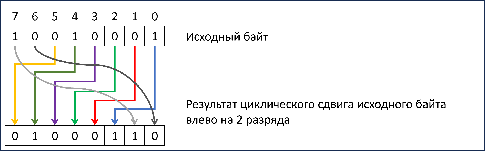

# Лабораторная работа №1. Работа с внешними файлами, использование массивов и операций манипулирования битами.	1


- [Лабораторная работа №1. Работа с внешними файлами, использование массивов и операций манипулирования битами.	1](#лабораторная-работа-1-работа-с-внешними-файлами-использование-массивов-и-операций-манипулирования-битами1)
  - [Обязательные задания](#обязательные-задания)
    - [Задание  1](#задание--1)
      - [Вариант №1 – copyfile – 20 баллов](#вариант-1--copyfile--20-баллов)
      - [Вариант №2 – compare – 40 баллов](#вариант-2--compare--40-баллов)


Практические задания

* На оценку «удовлетворительно» необходимо выполнить часть обязательных заданий и набрать не менее 60 баллов
* На оценку «хорошо» необходимо выполнить часть обязательных заданий и часть дополнительных и набрать не менее 250 баллов
* На оценку «отлично» необходимо выполнить все обязательные задания и часть дополнительных и набрать не менее 500 баллов

Внимание, дополнительные задания принимаются только после успешной защиты обязательных заданий.

## Обязательные задания
### Задание  1
Выполните задание одного из предложенных вариантов.
#### Вариант №1 – copyfile – 20 баллов
Разработайте программу copyfile.exe, выполняющую копирование одного текстового файла в другой. Параметры командной строки:

```sh
copyfile.exe <input file name> <output file name>
```
Программа должна корректно обрабатывать ошибки, связанные с файловыми операциями, а также корректно закрываться открываемые программой файлы.

В комплекте с программой должны обязательно поставляться файлы, позволяющие проверить ее работу в автоматическом режиме.

#### Вариант №2 – compare – 40 баллов
Разработайте программу compare.exe, выполняющую сравнение содержимого текстовых файлов. Формат командной строки:

```sh
compare.exe <file1> <file2>
```

В том случае, если файлы имеют одинаковое содержимое, программа должна вернуть нулевой результат в операционную систему и вывести строку «Files are equal” в стандартный поток вывода. В противном случае программа должна вывести номер первой строки, в которой были найдены расхождения в содержимом файлов: «Files are different. Line number is <номер строки>», и вернуть значение 1.

Программа должна корректно обрабатывать ошибки, связанные с файловыми операциями.
В комплекте с программой должны обязательно поставляться файлы, позволяющие проверить корректность её работы в автоматическом режиме.
Вариант №3 – findtext – 50 баллов
Разработайте программу findtext.exe, выполняющую поиск указанной строки в файле. Формат командной строки:
findtext.exe <file name> <text to search>
Например:
findtext.exe “Евгений Онегин.txt” “Я к Вам пишу”
В случае, когда искомая строка в файле найдена, приложение возвращает нулевое значение и выводит в стандартный выводной поток номера всех строк (по одному номеру в каждой строке), содержащих искомую строку. В противном случае программа возвращает 1 и выводит в стандартный поток вывода «Text not found».
При осуществлении поиска регистр символов имеет значение (это упрощает поиск). Слова «Онегин» и «онегин» являются разными.
Программа должна корректно обрабатывать ошибки, связанные с файловыми операциями.
В комплекте с программой должны обязательно поставляться файлы, позволяющие проверить корректность её работы в автоматическом режиме.
Вариант №4 – replace – 80 баллов
Разработайте программу replace.exe, выполняющую замену всех вхождений подстроки в текстовом файле на другую строку, и записывающей результат в выходной файл (отличный от входного). Формат командной строки:
replace.exe <input file> <output file> <search string> <replace string>
Программа должна корректно обрабатывать ошибки, связанные с открытием входных и выходных файлов. 
Размеры входных и выходных файлов таковы, что в оперативную память программы могут не поместиться целиком. Программа должна обрабатывать входной файл построчно и записывать результаты в выходной файл также построчно. Размеры искомой строки и строки-заменителя не ограничены (но с большой вероятностью в ОЗУ поместятся).
Внимание, программа корректно должна обрабатывать ситуацию, когда длина искомой строки равна нулю. В этом случае замены символов производиться не должно. Также корректно должна обрабатываться ситуация с многократным вхождением искомой строки в строку-заменитель (например, замена строки «ма» на «мама» не должна приводить к зацикливанию).
В комплекте с программой должны обязательно поставляться файлы, позволяющие проверить ее работу в автоматическом режиме:
•	.bat файл, выполняющий запуск программы с различными тестовыми параметрами. Необходимо проверить возможные граничные условия программы, включая недопустимые ситуации.
•	Эталонные входные и выходные файлы для проверки работы программы с тестовыми входными данными.
Внимание: из опыта автора сдаваемые студентами работы часто некорректно обрабатывают ситуацию с возвратом при неудачном поиске. Из-за этого не работает замена подстроки «1231234» внутри текста «12312312345». Добавьте обработку данной ситуации в набор тестов и убедитесь в корректности работы программы.
Вариант №5 – join – 50 баллов
Разработайте программу join.exe, выполняющую слияние содержимого нескольких входных бинарных файлов в выходной файл (отличный от входных). Формат командной строки:
join.exe <input file1> … <input file N> <output file>
Программа должна корректно обрабатывать ошибки, связанные с открытием входных и выходных файлов. Размеры входных и выходных файлов таковы, что в оперативную память программы могут не поместиться целиком.
В комплекте с программой должны обязательно поставляться файлы, позволяющие проверить ее работу в автоматическом режиме. 
Вариант №6 – extract – 50 баллов
Разработать приложение extract.exe, выполняющее извлечение фрагмента произвольной длины входного бинарного файла начиная с  произвольной позиции в выходной файл. Формат командной строки:
extract.exe <input file> <output file> <start position> <fragment size>
Программа должна корректно обрабатывать ошибки, связанные с открытием входных и выходных файлов, а также корректностью параметров start position и fragment size. В частности, выход за пределы исходного файла является недопустимым.
Размеры входных и выходных файлов таковы, что в оперативную память программы могут не поместиться целиком.
В комплекте с программой должны обязательно поставляться файлы, позволяющие проверить ее работу в автоматическом режиме.
Задание 2
Выполните задание одного из предложенных вариантов
Вариант №1 – calcbits – 20 баллов
Разработайте приложение calcbits.exe, выполняющее подсчет и вывод в output количества единичных битов в байте. Для подсчета единичных битов используйте операции манипулирования битами.  Формат командной строки:
calcbits.exe <byte>
где byte – число в десятичное системе, в двоичном представлении которого должен производиться подсчет установленных в единицу бит.
Например, вызов
calcbits.exe 5
должен выводить в output значение 2 (число 5 в двоичной системе равно 00000101).
В случае некорректных входных данных программа должна выводить пользователю сообщение об ошибке и возвращать ненулевое значение.
В комплекте с программой должны обязательно поставляться файлы, позволяющие проверить ее работу в автоматическом режиме.
Вариант №2 – rotatebyte – 30 баллов
Разработайте приложение rotatebyte.exe, выполняющее циклическое вращение битов в байте влево или вправо на заданное количество разрядов. Для решения задачи используйте операции манипулирования битами. Формат командной строки:
rotatebyte.exe <byte> <number of bits> <L / R>
На следующей диаграмме показан пример циклического сдвига некоторого байта на 2 разряда влево.

Например, в результате вызова
rotatebyte.exe 17 2 L
в стандартный поток вывода программа должна вывести 68
В случае некорректных входных данных (например, если вместо числа программе было передано что-то другое) программа должна выводить пользователю сообщение об ошибке и возвращать ненулевое значение.
В комплекте с программой должны обязательно поставляться файлы, позволяющие проверить ее работу в автоматическом режиме.
Вариант №3 – bin2dec – 30 баллов
Разработайте программу bin2dec.exe, выполняющую перевод числа из двоичной системы в десятичную и вывод результата в стандартный поток вывода. Формат командной строки:
bin2dec.exe <число в двоичной системе>
Входной параметр задается в виде целого числа без знака, заданного в двоичной системе в диапазоне от 0 до 232-1.
Например, в результате вызова
bin2dec.exe 110010000
в стандартный поток вывода должно быть выведено число 400.
Для перевода числа из двоичной системы в десятичную систему используйте арифметические операции и операции манипулирования битами.
В том случае, когда в качестве входного параметра указано некорректное двоичное число, программа должна вывести соответствующее сообщение об ошибке.
В комплекте с программой должны обязательно поставляться файлы, позволяющие проверить ее работу в автоматическом режиме.
Вариант №4 – dec2bin – 30 баллов
Разработайте программу dec2bin.exe, выполняющую перевод числа из десятичной системы в двоичную и вывод результата в стандартный поток вывода. Формат командной строки:
bin2dec.exe <число в десятичной системе>
Входной параметр задается в виде целого числа без знака , заданного в двоичной системе в диапазоне от 0 до 232-1. Выводимое число в двоичной не должно содержать незначащих нулевых бит.
Например, в результате вызова
bin2dec.exe 253
в стандартный поток вывода должно быть выведено число 11111101.
Для перевода числа из десятичной системы в двоичную систему используйте арифметические операции и операции манипулирования битами.
В том случае, когда в качестве входного параметра указано некорректное десятичное число, программа должна вывести соответствующее сообщение об ошибке.
В комплекте с программой должны обязательно поставляться файлы, позволяющие проверить ее работу в автоматическом режиме.
Вариант №5 – flipbyte – 50 баллов
Разработайте приложение flipbyte.exe, выполняющее изменение порядка следования двоичных битов в 8-битовом целом числе (байте), заданном в десятичном представлении, на противоположный. Для этого используйте операторы для работы с битами. «Перевернутый» байт выводится в output также в десятичном представлении с завершающим символом перевода строки \n. Формат командной строки приложения:
flipbyte.exe <входной байт>
Например, в результате вызова
flipbyte.exe 6
в output должно быть выведено 96 (610 = 000001102, после изменения порядка битов данное число превратится в 011000002 = 9610)
Некорректные входные данные (например, передача строки, не являющейся десятичным числом, или числа, выходящего за пределы 0-255) должно выводиться соответствующе сообщение об ошибке.
В комплекте с программой должны обязательно поставляться файлы, позволяющие проверить ее работу в автоматическом режиме.
Вариант №6 – radix – 100 баллов
Разработайте программу radix.exe, выполняющую перевод чисел из одной произвольной системы счисления в другую произвольную и запись результата в стандартный поток вывода. Под произвольной системой счисления понимается система с основанием от 2 до 36. Системы счисления с 11-ричной до 36-ричной должны использовать заглавные буквы латинского алфавита от A до Z для представления разрядов с 1010 до 3510. Формат командной строки приложения:
radix.exe <source notation> <destination notation> <value>
Например, следующим способом программа должна осуществлять перевод шестнадцатеричного числа 1F в его десятичное представление:
radix.exe 16 10 1F
В конце строки, выводимой в стандартный поток вывода должен располагаться код \n.
Программа должна быть способна осуществлять перевод как положительных, так и отрицательных чисел, а также нуля. Особое внимание уделите переводу максимальных и минимальных целых чисел на данной платформе (они должны преобразовываться корректно).
Программа должна корректно обрабатывать ошибки 
Внимание, для перевода строкового представления в числовое и числового в строковое в произвольных системах счисления должны быть разработаны функции:
int StringToInt(const string& str, int radix, bool & wasError);
и
std::string IntToString(int n, int radix, bool & wasError);
В случае ошибок (некорректные значения входных параметров, переполнение при переводе строки в число) данные функции должны изменять состояние булевой переменной wasError.
В случае обнаружения ошибки программа должна вывести соответствующее сообщение и корректно завершить свою работу.
В комплекте с программой должны обязательно поставляться файлы, позволяющие проверить ее работу в автоматическом режиме.
Задание 3
Выполните задание одного из предложенных вариантов
Вариант №1 – multmatrix – 40 баллов
Разработайте приложение multmatrix.exe, выполняющее перемножение двух матриц размером 3*3, коэффициенты которых заданы во входных файлах (смотрите matrix.txt в качестве иллюстрации), и выводящее результат умножения в стандартный поток вывода. Формат командной строки приложения:
multmatrix.exe <matrix file1> <matrix file2>
Коэффициенты матриц задаются в текстовых файлах в трех строках по 3 элемента.
Коэффициенты результирующей матрицы выводятся с точностью до 3 знаков после запятой.
Используйте двухмерные массивы для хранения коэффициентов матриц.
В комплекте с программой должны обязательно поставляться файлы, позволяющие проверить ее работу в автоматическом режиме.
Вариант №2 – invert – 80 баллов
Разработайте приложение invert.exe, выполняющее инвертирование матрицы 3*3, т.е. нахождение обратной матрицы  и выводящее коэффициенты результирующей матрицы в стандартный поток вывода. Формат командной строки приложения:
invert.exe <matrix file1>
Коэффициенты входной матрицы заданы во входном текстовом файле (смотрите файл matrix.txt в качестве иллюстрации)  в трех строках по 3 элемента.
Коэффициенты результирующей матрицы выводятся с точностью до 3 знаков после запятой.
Используйте двухмерные массивы для хранения коэффициентов матриц.
В комплекте с программой должны обязательно поставляться файлы, позволяющие проверить ее работу в автоматическом режиме.
Дополнительные задания
Задание 4
Выполните задания одного из предложенных вариантов.
Вариант №1 – rle – 100 баллов
Разработайте приложение rle.exe, выполняющее RLE-компрессию бинарных файлов с сильно разреженным содержимым, а также декомпрессию упакованных ею файлов. Необходимо реализовать следующий принцип компрессии файла:
При обнаружении последовательности одинаковых байтов, она кодируется при помощи двух байтов. Первый байт хранит количество повторов следующего за ним байтов. Например, последовательность байт AAABBBBC, будет представлена в виде следующей последовательности байт:
3, 'A', 4, 'B', 1, 'C'
Таким образом, исходная 8-байтовая последовательность будет представлена при помощи всего шести байт.
Входные файлы нулевой длины представляются в виде выходных файлов нулевой длины.
Очевидно, что последовательность одинаковых байтов длиной более 255 байт двумя байтами закодирована быть не может, в этом случае первые 2 байта кодируют первые 255 байт последовательности, а затем обрабатываются следующие байты последовательности. Также очевидно, что однобайтовые последовательности требуют в 2 раза больше данных. Тем не менее, в качестве учебного задания для ознакомления с функциями файлового ввода-вывода задание вполне подходит.
Формат параметров командной строки.
Упаковка:
rle.exe pack <input file> <output file>
Распаковка:
rle.exe unpack <input file> <output file>
Программа должна корректно обрабатывать ошибки, связанные с открытием входных и выходных файлов.
Размеры входных и выходных файлов таковы, что в оперативную память программы могут не поместиться целиком.
В комплекте с программой должен обязательно поставляться .bat файл, позволяющий проверить работу программы в автоматическом режиме, а также эталонные значения входных и выходных файлов. Проверка должна проверять как корректность работы в режиме упаковки, так и в режиме распаковки. Особое внимание следует уделить проверке работы граничных условий работы программы:
•	Входной файл нулевой длины
•	Тестирование файлов, содержащих последовательности одинаковых символов в 255, 256 и 257 байт
•	Недопустимые ситуации: нечетная длина запакованного файла, количество повторений символа, равное нулю
•	Файл, содержащий символы с кодом 255 
Вариант №2 – bmpinfo – 60 баллов
Разработайте приложение bmpinfo.exe, выполняющее считывание заголовка входного файла и, если, судя по заголовку, формат файла соответствует признакам формата BMP (информацию о структуре BMP файла можно найти в Интернет), то необходимо вывести в output следующую информацию:
•	Разрешение (ширина и высота файла)
•	Количество бит на пиксель
•	В случае, если в BMP файле используется палитра (8 и менее бит), необходимо вывести количество используемых цветов.
•	Размер изображения в байтах (количество байт, которые занимают данные изображения без учёта размера информационных заголовков BMP)
Если входной файл не является файлом формата BMP, то вывести об этом соответствующее сообщение.
Формат командной строки:
bmpinfo.exe <input file name>
Программа должна корректно обрабатывать ошибки, связанные с файловыми операциями.
Размеры входных и выходных файлов таковы, что в оперативную память программы могут не поместиться целиком.
В комплекте с программой должны обязательно поставляться файлы, позволяющие проверить ее работу в автоматическом режиме. 
Примечание: BMP-файлы (редко) могут использовать PNG, RLE или Jpeg-компрессию данных – в этом случае нужно вывести соответствующую информацию
Вариант №3 – crypt – 120 баллов
Разработайте приложение crypt.exe, выполняющее шифрование/дешифрование содержимого входного бинарного файла, и записывающего результат в выходной файл. Формат командной строки:
для шифрования:
crypt.exe crypt <input file> <output file> <key> 
для дешифрования
crypt.exe decrypt <input file> <output file> <key> 
Параметр key – целое число от 0 до 255, использующееся в алгоритме шифрования и дешифрования.
В качестве алгоритма шифрования должен использоваться следующий алгоритм, осуществляющий последовательно следующие операции с каждым байтом входного файла и записывающий результат в выходной файл:
1.	Операция побитового XOR (исключающее ИЛИ, в Си/Си++ осуществляется при помощи оператора ^, например: 3 ^ 2 дает в результате 1, а 1 ^ 2 дает в результате 3) между байтом из файла и параметром key, переданном с командной строки.
2.	Перемешивание битов в байте, полученном в результате предыдущей операции по следующей схеме (используйте операции для манипулирования битами):
 
3.	Запись в выходной файл.
Алгоритм дешифрования идентичен алгоритму шифрования с той лишь разницей, что сначала выполняется перемешивание битов в обратном направлении, а затем операция XOR с параметром key, использованном при шифровании. Примечательной особенностью операции XOR является следующее свойство:
(A XOR B) XOR B = A XOR (B XOR B) = A XOR 0 = A
Некорректные входные данные (например, передача в качестве ключа строки, не являющейся десятичным числом, или числа, выходящего за пределы 0-255) должно выводиться соответствующе сообщение об ошибке. То же самое касается обработки ошибок открытия входного и выходного файлов.
Размеры входных и выходных файлов таковы, что в оперативную память программы могут не поместиться целиком.
В комплекте с программой должны обязательно поставляться файлы, позволяющие проверить ее работу в автоматическом режиме.
Задание 5
Выполните задание одного из предложенных вариантов.
Вариант №1 – live – 150 баллов
Разработайте программу live.exe, моделирующую одну итерацию (расчет следующего поколения) клеточного автомата игры Жизнь.
Место действия этой игры — «вселенная» — это размеченная на клетки поверхность, безграничная, ограниченная, или замкнутая. В случае данной лабораторной работы поверхность является ограниченной. За границами поля клетки считаются пустыми. Каждая клетка на этой поверхности может находиться в двух состояниях: быть живой или быть мёртвой. Клетка имеет восемь соседей. Распределение живых клеток в начале игры называется первым поколением. Каждое следующее поколение рассчитывается на основе предыдущего по таким правилам:
•	пустая (мёртвая) клетка рядом с тремя живыми клетками-соседями оживает;
•	если у живой клетки есть две или три живые соседки, то эта клетка продолжает жить; в противном случае (если соседок меньше двух или больше трёх) клетка умирает (от «одиночества» или от «перенаселённости»).
Состояние первого поколения задается при помощи содержимого входного текстового файла следующего вида:
 
Символом * задаются границы поля (максимум, 256 * 256), а символом # задается положение живых клеток колонии.
Формат командной строки:
Life.exe <input file> [<output file>]
Если параметр <ouput file> не указан, то вывод следующего состояния колонии производится в стандартный поток вывода.
Внимание – на решение о том, выживет клетка, погибнет или родится, не должно влиять изменения состояния соседних клеток обработанных перед данной клеткой. Для этого можно использовать два двухмерных массива. Первый - массив с исходным состоянием колонии, заполняемый из входного файла, а второй - массив со следующим состоянием колонии, рассчитывающийся по правилам игры на основе исходного массива и записывающийся в выходной файл (или выводящийся в output).
В комплекте с программой должны обязательно поставляться файлы, позволяющие проверить ее работу в автоматическом режиме.
Вариант №2 – labyrinth – 180 баллов
Разработайте программу labyrinth.exe, выполняющую поиск одного из возможных кратчайших путей между двумя точками в лабиринте, заданном в текстовом файле. Начальные и конечные точки задаются при помощи символов A и B. Найденный путь изображается при помощи символа «точка».
Лабиринт имеет максимальные размеры до 100*100 клеток и не обязательно должен иметь прямоугольную форму – задача приложения самостоятельно определить границы лабиринта, просканировав входной файл.
Во входном файле могут быть не заданы начальная и конечная точки, либо заданы больше чем 1 раз. При обнаружении такой ситуации приложение должно сообщить пользователю об ошибке.
При отсутствии пути между точками A и B необходимо вывести лабиринт без указания пути.
Формат командой строки:
labyrinth.exe <input file> <output file>
  
 
Для поиска кратчайшего пути можно использовать, например, Волновой Алгоритм.
В комплекте с программой должны обязательно поставляться файлы, позволяющие проверить ее работу в автоматическом режиме.
Внимание: в случае использования рекурсии программа должна умеренно использовать область стека, чтобы ее работа не приводила к переполнению стека (около 1 или 2 мегабайт) ни при каких допустимых входных данных.
Вариант №3 – fill – 180 баллов
Разработать приложение fill.exe, выполняющее заливку контуров, заданных в текстовом файле начиная с указанных начальных точек.
  
Максимальный размер изображения, заданного в текстовом файле – 100*100 точек. При загрузке входных файлов программа может игнорировать элементы за пределами 100 строки или столбца.
Символ 'O' обозначает точки, начиная с которых должна выполняться заливка контуров.
Формат командной строки:
fill.exe <input file> <output file>
В комплекте с программой должны обязательно поставляться файлы, позволяющие проверить ее работу в автоматическом режиме.
Внимание: если точка начала заливки находится вне контуров, либо граница контуров содержит разрывы, заливка должна «проливаться» во внешнюю область (но не выходить за пределы 100*100).
Внимание: в случае использования рекурсии программа должна умеренно использовать область стека, чтобы ее работа не приводила к переполнению стека (около 1 или 2 мегабайт) ни при каких допустимых входных данных.
