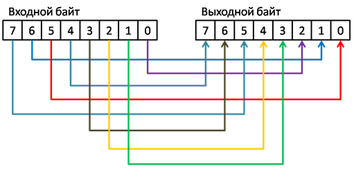
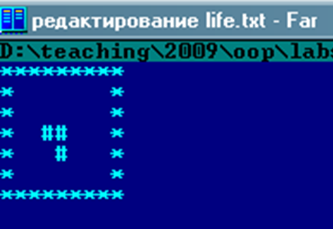

# Лабораторная работа №1. Работа с внешними файлами, использование массивов и операций манипулирования битами.

- [Лабораторная работа №1. Работа с внешними файлами, использование массивов и операций манипулирования битами.](#лабораторная-работа-1-работа-с-внешними-файлами-использование-массивов-и-операций-манипулирования-битами)
  - [Практические задания](#практические-задания)
  - [Обязательные задания](#обязательные-задания)
    - [Задание 1](#задание-1)
      - [Вариант №1 – copyfile – 20 баллов](#вариант-1--copyfile--20-баллов)
      - [Вариант №2 – compare – 40 баллов](#вариант-2--compare--40-баллов)
      - [Вариант №3 – findtext – 50 баллов ](#вариант-3--findtext--50-баллов-)
      - [Вариант №4 – replace – 80 баллов ](#вариант-4--replace--80-баллов-)
        - [Пример 1](#пример-1)
        - [Пример 2](#пример-2)
        - [Пример 3](#пример-3)
      - [Пример 4](#пример-4)
      - [Примечание](#примечание)
      - [Вариант №5 – join – 50 баллов ](#вариант-5--join--50-баллов-)
      - [Вариант №6 – extract – 50 баллов ](#вариант-6--extract--50-баллов-)
    - [Задание 2](#задание-2)
      - [Вариант №1 – calcbits – 20 баллов](#вариант-1--calcbits--20-баллов)
        - [Примеры](#примеры)
          - [Пример 1](#пример-1-1)
          - [Пример 2](#пример-2-1)
          - [Пример 3](#пример-3-1)
      - [Вариант №2 – rotatebyte – 30 баллов ](#вариант-2--rotatebyte--30-баллов-)
      - [Вариант №3 – bin2dec – 30 баллов ](#вариант-3--bin2dec--30-баллов-)
        - [Формат входных данных](#формат-входных-данных)
        - [Формат выходных данных](#формат-выходных-данных)
        - [Примеры](#примеры-1)
          - [Пример 1](#пример-1-2)
          - [Пример 2](#пример-2-2)
          - [Пример 3](#пример-3-2)
      - [Вариант №4 – dec2bin – 30 баллов ](#вариант-4--dec2bin--30-баллов-)
        - [Формат входных данных](#формат-входных-данных-1)
        - [Формат выходных данных](#формат-выходных-данных-1)
        - [Примеры](#примеры-2)
          - [Пример 1](#пример-1-3)
          - [Пример 2](#пример-2-3)
          - [Пример 3](#пример-3-3)
      - [Вариант №5 – flipbyte – 50 баллов ](#вариант-5--flipbyte--50-баллов-)
      - [Вариант №6 – radix – 100 баллов ](#вариант-6--radix--100-баллов-)
      - [Вариант 7 - magic\_numbers - 50 баллов](#вариант-7---magic_numbers---50-баллов)
        - [Бонус в 10 баллов за возможность поиска магических чисел](#бонус-в-10-баллов-за-возможность-поиска-магических-чисел)
      - [Вариант 8 - same\_week\_day - 50 баллов](#вариант-8---same_week_day---50-баллов)
        - [Формат входных данных](#формат-входных-данных-2)
        - [Формат выходных данных](#формат-выходных-данных-2)
        - [Примеры](#примеры-3)
    - [Задание 3](#задание-3)
      - [Вариант №1 – multmatrix – 40 баллов ](#вариант-1--multmatrix--40-баллов-)
        - [Формат входных данных](#формат-входных-данных-3)
        - [Формат выходных данных](#формат-выходных-данных-3)
        - [Примеры работы программы через стандартный поток ввода](#примеры-работы-программы-через-стандартный-поток-ввода)
          - [Пример 1](#пример-1-4)
          - [Пример 2](#пример-2-4)
          - [Пример 3](#пример-3-4)
        - [Примечания](#примечания)
      - [Вариант №2 – invert – 80 баллов ](#вариант-2--invert--80-баллов-)
        - [Формат входных данных](#формат-входных-данных-4)
        - [Формат выходных данных](#формат-выходных-данных-4)
        - [Сообщения об ошибках](#сообщения-об-ошибках)
        - [Примеры](#примеры-4)
          - [Пример 1](#пример-1-5)
          - [Пример 2](#пример-2-5)
          - [Пример 3](#пример-3-5)
          - [Пример 4](#пример-4-1)
  - [Дополнительные задания](#дополнительные-задания)
    - [Задание 4](#задание-4)
      - [Вариант №1 – rle – 100 баллов ](#вариант-1--rle--100-баллов-)
      - [Вариант №2 – bmpinfo – 60 баллов ](#вариант-2--bmpinfo--60-баллов-)
      - [Вариант №3 – crypt – 120 баллов ](#вариант-3--crypt--120-баллов-)
    - [Задание 5](#задание-5)
      - [Вариант №1 – live – 150 баллов ](#вариант-1--live--150-баллов-)
      - [Вариант №2 – labyrinth – 180 баллов ](#вариант-2--labyrinth--180-баллов-)
        - [Формат входных данных](#формат-входных-данных-5)
        - [Формат выходных данных](#формат-выходных-данных-5)
        - [Пример 1](#пример-1-6)
        - [Пример 2](#пример-2-6)
      - [Вариант №3 – fill – 180 баллов](#вариант-3--fill--180-баллов)
        - [Формат входных данных](#формат-входных-данных-6)
        - [Формат выходных данных](#формат-выходных-данных-6)
      - [Примеры ввода-вывода](#примеры-ввода-вывода)

## Практические задания

- На оценку «**удовлетворительно**» необходимо набрать не менее 150 баллов
- На оценку «**хорошо**» необходимо набрать не менее 300 баллов
- На оценку «**отлично**» необходимо выполнить набрать не менее 500 баллов

Внимание, дополнительные задания принимаются только **после успешной защиты** обязательных заданий.

## Обязательные задания

### Задание 1

Выполните задание одного из предложенных вариантов.

#### Вариант №1 – copyfile – 20 баллов

Разработайте программу **copyfile.exe**, выполняющую копирование одного **текстового** файла в другой.
Параметры командной строки:

```sh
copyfile.exe <input file name> <output file name>
```

Программа должна корректно обрабатывать ошибки, связанные с файловыми операциями, а также корректно закрывать файлы, когда они больше не нужны.

В комплекте с программой должны обязательно поставляться файлы, позволяющие проверить ее работу в автоматическом режиме.

#### Вариант №2 – compare – 40 баллов

Разработайте программу **compare.exe**, выполняющую сравнение содержимого **текстовых** файлов. Формат командной строки:

```sh
compare.exe <file1> <file2>
```

В том случае, если файлы имеют одинаковое содержимое, программа должна вернуть нулевой результат в операционную систему и вывести строку «Files are equal» в стандартный поток вывода. В противном случае программа должна вывести номер первой строки, в которой были найдены расхождения в содержимом файлов: «Files are different. Line number is <номер строки>», и вернуть значение 1.

Программа должна корректно обрабатывать ошибки, связанные с файловыми операциями.

В комплекте с программой должны обязательно поставляться файлы, позволяющие проверить корректность её работы в автоматическом режиме.

#### Вариант №3 – findtext – 50 баллов <a name="findtext"></a>

Разработайте программу **findtext.exe**, выполняющую поиск указанной строки в файле. Формат командной строки:

```sh
findtext.exe <file name> <text to search>
```

Например:

```sh
findtext.exe "Евгений Онегин.txt" "Я к Вам пишу"
```

В случае, когда искомая строка в файле найдена, приложение возвращает **нулевое** значение и выводит в стандартный выводной поток номера всех строк (по одному номеру в каждой строке), содержащих искомую строку. В противном случае программа возвращает 1 и выводит в стандартный поток вывода «Text not found».

При осуществлении поиска регистр символов имеет значение (это упрощает поиск). Слова «**Онегин**» и «**онегин**» являются разными.

Программа должна корректно обрабатывать ошибки, связанные с файловыми операциями.

В комплекте с программой должны обязательно поставляться файлы, позволяющие проверить корректность её работы в автоматическом режиме.

#### Вариант №4 – replace – 80 баллов <a name="replace"></a>

Разработайте программу **replace.exe**, выполняющую замену всех вхождений подстроки в текстовом файле на другую строку,
и записывающую результат в выходной файл (отличный от входного).

Программа должна поддерживать три режима работы:

- **Ввод через командную строку:**

```sh
replace.exe <input file> <output file> <search string> <replace string>
```

- **Ввод через stdin:** Если программа запускается без параметров,
  она должна принимать первой строкой искомую строку, второй строкой - строку-заменитель,
  затем текст для замены.

```sh
ma
mama
mama delala pelmeni
ya pokushal plotno
```

где "ma" - искомая строка, "mama" - строка-заменитель, "mama delala pelmeni
ya pokushal plotno" - текст для замены.

- **Справка:** Если программа запускается с параметром **-h**,
  она должна вывести краткую справку об использовании и завершить выполнение.

Программа должна корректно обрабатывать ошибки, связанные с открытием входных и выходных файлов.

Размеры входных и выходных файлов таковы, что в оперативную память программы могут не поместиться целиком.
Программа должна обрабатывать входной файл построчно и записывать результаты в выходной файл также построчно.
Размеры искомой строки и строки-заменителя не ограничены (но с большой вероятностью в ОЗУ поместятся).

Внимание, **программа корректно должна обрабатывать ситуацию, когда длина искомой строки равна нулю**.
В этом случае замены символов производиться не должно.
Также корректно должна обрабатываться ситуация с многократным вхождением искомой строки в строку-заменитель
(например, замена строки «ма» на «мама» не должна приводить к зацикливанию).

В случае ошибки программа должна вести себя по-разному в зависимости от способа запуска:

- Если программа запущена с параметрами командной строки, она должна вывести в стандартный поток вывода «**ERROR**»
  и завершиться с кодом возврата 1.
- Если программа запущена без параметров (режим stdin), она должна вывести в стандартный поток вывода «**ERROR**»
  и завершиться с кодом возврата 0.
  Это необходимо для корректного тестирования программы в системе Яндекс.Contest.
  Ошибка возникает, когда пользователь не ввёл искомую строку либо строку заменитель,
  а завершил ввод комбинацией клавиш `Ctrl+Z` под Windows или `Ctrl+D` под Linux.

##### Пример 1

Ввод:

```txt
ma
mama
mama delala pelmeni
```

Вывод:

```txt
mamamama delala pelmeni
```

Объяснение: "ma" заменяется на "mama".

##### Пример 2

Ввод:

```txt
1231234
XYZ
12312312345
```

Вывод:

```txt
123XYZ5
```

Объяснение: "1231234" заменяется на "XYZ".

##### Пример 3

Ввод:

```txt

tam
tut text
```

Вывод:

```txt
tut text
```

Объяснение: программа выведет исходный текст, так как первый параметр (искомая строка) — пустая строка.

#### Пример 4

Ввод:

```txt
hello
```

Вывод:

```txt
ERROR
```

Объяснение: вместо строки-заменителя пользователь ввёл символ конца файла.

#### Примечание

В комплекте с программой должны обязательно поставляться файлы, позволяющие проверить ее работу в автоматическом режиме:

- .bat файл, выполняющий запуск программы с различными тестовыми параметрами.
Необходимо проверить возможные граничные условия программы, включая недопустимые ситуации.
- Эталонные входные и выходные файлы для проверки работы программы с тестовыми входными данными.

<span style="color:red">**Внимание**: из опыта автора сдаваемые студентами работы часто некорректно
обрабатывают ситуацию с возвратом при неудачном поиске. Из-за этого не работает замена подстроки «1231234»
внутри текста «12312312345». **Добавьте обработку данной ситуации в набор тестов и убедитесь в корректности
работы программы.**</span>

#### Вариант №5 – join – 50 баллов <a name="join"></a>

Разработайте программу **join.exe**, выполняющую слияние содержимого нескольких входных **бинарных файлов** в выходной файл (отличный от входных). Формат командной строки:

```sh
join.exe <input file1> ... <input file N> <output file>
```

Программа должна корректно обрабатывать ошибки, связанные с открытием входных и выходных файлов. Размеры входных и выходных файлов таковы, что в оперативную память программы могут не поместиться целиком.

В комплекте с программой должны обязательно поставляться файлы, позволяющие проверить ее работу в автоматическом режиме. 

#### Вариант №6 – extract – 50 баллов <a name="extract"></a>

Разработать приложение **extract.exe**, выполняющее извлечение фрагмента произвольной длины входного **бинарного** файла начиная с  произвольной позиции в выходной файл. Формат командной строки:

```sh
extract.exe <input file> <output file> <start position> <fragment size>
```

Программа должна корректно обрабатывать ошибки, связанные с открытием входных и выходных файлов, а также корректностью параметров start position и fragment size. В частности, выход за пределы исходного файла является недопустимым.

Размеры входных и выходных файлов таковы, что в оперативную память программы могут не поместиться целиком.

В комплекте с программой должны обязательно поставляться файлы, позволяющие проверить ее работу в автоматическом режиме.

### Задание 2

Выполните задание одного из предложенных вариантов

#### Вариант №1 – calcbits – 20 баллов<a name="calcbits"></a>

Разработайте приложение **calcbits.exe**, выполняющее подсчет и вывод в output количества единичных битов в байте.

Для подсчета единичных битов используйте **операции манипулирования битами**.

Программа должна быть способна работать в трёх режимах:

- При запуске без параметров командной строки программа считывает число (байт) из stdin и выводит результат в stdout.
- При запуске из командной строки число передается в качестве параметра.
- Вывод краткой инструкции об использовании. Если в командной строке программы передан параметр `-h`, она должна вывести справку о своём использовании и завершить работу.

В случае некорректных входных данных:

- Если программа запущена с параметром командной строки, она должна вывести в стандартный поток вывода «Invalid argument» и завершиться с кодом возврата 1.
- Если программа запущена без параметров (режим stdin), она должна вывести в стандартный поток вывода «Invalid argument» и завершиться с кодом возврата 0.
  Это необходимо для корректного тестирования программы в системе Яндекс.Contest

##### Примеры

Передача параметра через командную строку:

```sh
calcbits.exe <byte>
```

где **byte** – число в десятичное системе, в двоичном представлении которого должен производиться подсчет установленных в единицу бит.

Считывает число из стандартного ввода:

```sh
calcbits.exe
```

Выводит краткую справку об использовании программы:

```sh
calcbits.exe -h
```

###### Пример 1

Ввод

```txt
5
````

Вывод:

```txt
2
```

Объяснение: число 5 в двоичной системе равно 00000101, где установлены 2 бита в 1.

###### Пример 2

Ввод

```txt
255
````

Вывод:

```txt
8
```

Объяснение: число 255 в двоичной системе — это 11111111, где все 8 бит установлены в 1.

###### Пример 3

Ввод

```txt
-5
````

Вывод:

```txt
Invalid argument
```

Объяснение: число -5 отрицательное и не входит в диапазон значений байта от 0 до 255.

#### Вариант №2 – rotatebyte – 30 баллов <a name="rotatebyte"></a>

Разработайте приложение **rotatebyte.exe**, выполняющее **циклическое вращение** битов в байте влево или вправо на заданное количество разрядов. Для решения задачи используйте операции манипулирования битами. Формат командной строки:

```sh
rotatebyte.exe <byte> <number of bits> <L / R>
```

На следующей диаграмме показан пример циклического сдвига некоторого байта на 2 разряда влево.


Например, в результате вызова

```sh
rotatebyte.exe 17 2 L
```

в стандартный поток вывода программа должна вывести **68**

В случае некорректных входных данных (например, если вместо числа программе было передано что-то другое) программа должна выводить пользователю сообщение об ошибке и возвращать ненулевое значение.

В комплекте с программой должны обязательно поставляться файлы, позволяющие проверить ее работу в автоматическом режиме.

#### Вариант №3 – bin2dec – 30 баллов <a name="bin2dec"></a>

Разработайте программу **bin2dec.exe**, выполняющую перевод числа из двоичной системы в десятичную
и вывод результата в стандартный поток вывода.

Программа должна поддерживать три режима работы:

- **Ввод через командную строку:** Программа принимает число, в качестве параметра командной строки
- **Ввод через stdin:** Если программа запускается без параметров,
  она должна принимать число из стандартного потока ввода (stdin)
- **Справка:** Если программа запускается с параметром **-h**,
  она должна вывести краткую справку об использовании и завершить выполнение.

В комплекте с программой должны обязательно поставляться файлы, позволяющие проверить ее работу в автоматическом режиме.

##### Формат входных данных

Входной параметр задается в виде целого числа без знака, заданного в двоичной системе в диапазоне от 0 до $2^{32} - 1$
Для перевода числа из двоичной системы в десятичную систему используйте арифметические операции
и операции манипулирования битами.

В случае некорректных входных данных:

- Если программа запущена с параметром командной строки, она должна вывести в стандартный поток вывода «**ERROR**»
  и завершиться с кодом возврата 1.
- Если программа запущена без параметров (режим stdin), она должна вывести в стандартный поток вывода «**ERROR**»
  и завершиться с кодом возврата 0.
  Это необходимо для корректного тестирования программы в системе Яндекс.Contest.

##### Формат выходных данных

Выводимое число в двоичной системе не должно содержать незначащих нулевых бит.

##### Примеры

Передача параметра через командную строку:

```sh
bin2dec.exe <число в двоичной системе>
```

Считывает число из стандартного ввода:

```sh
bin2dec.exe
```

Выводит краткую справку об использовании программы:

```sh
bin2dec.exe -h
```

###### Пример 1

Ввод:

```txt
110010000
```

Вывод:

```txt
400
```

Объяснение: число 110010000 в десятичной системе равно 400.

###### Пример 2

Ввод:

```txt
1010
```

Вывод:

```txt
10
```

Объяснение: число 1010 в десятичной системе равно 10.

###### Пример 3

Ввод:

```txt
-100
```

Вывод:

```txt
ERROR
```

Объяснение: программа выводит «ERROR», поскольку введено некорректное число.

#### Вариант №4 – dec2bin – 30 баллов <a name="dec2bin"></a>

Разработайте программу **dec2bin.exe**, выполняющую перевод числа из десятичной системы счисления в двоичную и выводящую результат в стандартный поток вывода.

Программа должна поддерживать три режима работы:

- **Ввод через командную строку:** Программа принимает число, в качестве параметра командной строки
- **Ввод через stdin:** Если программа запускается без параметров, она должна принимать число из стандартного потока ввода (stdin)
- **Справка:** Если программа запускается с параметром **-h**, она должна вывести краткую справку об использовании программы и завершить выполнение.

В комплекте с программой должны обязательно поставляться файлы, позволяющие проверить ее работу в автоматическом режиме.

##### Формат входных данных

Входные данные задаются в виде целого числа без знака, заданного в десятичной системе в диапазоне от 0 до $2^{32} - 1$.
Для перевода числа из десятичной системы в двоичную систему используйте **арифметические операции** и **операции манипулирования битами**.

В случае некорректных входных данных:

- Если программа запущена с параметром командной строки, она должна вывести в стандартный поток вывода «**ERROR**» и завершиться с кодом возврата 1.
- Если программа запущена без параметров (режим stdin), она должна вывести в стандартный поток вывода «**ERROR**» и завершиться с кодом возврата 0.
  Это необходимо для корректного тестирования программы в системе Яндекс.Contest

##### Формат выходных данных

Выводимое число в двоичной системе не должно содержать незначащих нулевых бит.

##### Примеры

Передача параметра через командную строку:

```sh
dec2bin.exe <число в десятичной системе>
```

Считывает число из стандартного ввода:

```sh
dec2bin.exe
```

Выводит краткую справку об использовании программы:

```sh
dec2bin.exe -h
```

###### Пример 1

Ввод:

```txt
253
```

Вывод:

```txt
11111101
```

Объяснение: число 253 в двоичной системе равно 11111101.

###### Пример 2

Ввод:

```txt
5
```

Вывод:

```txt
101
```

Объяснение: число 5 в двоичной системе равно 101.

###### Пример 3

Ввод:

```txt
-10
```

Вывод:

```txt
ERROR
```

Объяснение: программа выводит «ERROR», поскольку введено некорректное число.

#### Вариант №5 – flipbyte – 50 баллов <a name="flipbyte"></a>

Разработайте приложение **flipbyte.exe**, выполняющее изменение порядка следования двоичных битов в 8-битовом целом числе (байте), заданном в десятичном представлении, на противоположный. Для этого используйте операторы для работы с битами. «Перевернутый» байт выводится в output также в десятичном представлении с завершающим символом перевода строки \n. Формат командной строки приложения:

```sh
flipbyte.exe <входной байт>
```

Например, в результате вызова

```sh
flipbyte.exe 6
```

в output должно быть выведено 96 ($6_{10}$ = $00000110_2$, после изменения порядка битов данное число превратится в $01100000_2$ = $96_{10}$)

Некорректные входные данные (например, передача строки, не являющейся десятичным числом, или числа, выходящего за пределы 0-255) должно выводиться соответствующе сообщение об ошибке.

В комплекте с программой должны обязательно поставляться файлы, позволяющие проверить ее работу в автоматическом режиме.

#### Вариант №6 – radix – 100 баллов <a name="radix"></a>

Разработайте программу **radix.exe**, выполняющую перевод чисел из одной произвольной системы счисления в другую произвольную и запись результата в стандартный поток вывода. Под произвольной системой счисления понимается система с основанием от 2 до 36. Системы счисления с 11-ричной до 36-ричной должны использовать **заглавные** буквы латинского алфавита от A до Z для представления разрядов с $10_{10}$ до $35_{10}$. Формат командной строки приложения:

```sh
radix.exe <source notation> <destination notation> <value>
```

Например, следующим способом программа должна осуществлять перевод шестнадцатеричного числа 1F в его десятичное представление:

```sh
radix.exe 16 10 1F
```

В конце строки, выводимой в стандартный поток вывода **должен располагаться код \n**.

Программа должна быть способна осуществлять перевод **как положительных, так и отрицательных чисел**, а также нуля. Особое внимание уделите переводу максимальных и минимальных целых чисел на данной платформе (они должны преобразовываться корректно).

Программа должна корректно обрабатывать ошибки 

Внимание, для перевода строкового представления в числовое и числового в строковое в произвольных системах счисления должны быть разработаны функции:

```c++
int StringToInt(const string& str, int radix, bool & wasError);
```

и

```c++
std::string IntToString(int n, int radix, bool & wasError);
```

В случае ошибок (некорректные значения входных параметров, переполнение при переводе строки в число) данные функции **должны изменять состояние булевой переменной wasError**.

В случае обнаружения ошибки программа должна вывести соответствующее сообщение и корректно завершить свою работу.

В комплекте с программой должны обязательно поставляться файлы, позволяющие проверить ее работу в автоматическом режиме.

#### Вариант 7 - magic_numbers - 50 баллов

Неотрицательное число является магическим, если для него выполняется условие: "Разность этого числа и суммы его десятичных цифр **не кратна** 9". Напишите программу, которая определяет, является ли введённое пользователем число магическим.

Программе в stdin поступает 64-разрядное целое беззнаковое число типа `uint64_t`.

Программа должна вывести в stdout:

- Строку "Magic", если введённое число - магическое.
- Строку "Non-magic", если введённое число - не магическое.
- Строку "Error", если на вход программы подали данные, непредставимые в виде числа типа `uint64_t`.

Подсказка: чтобы использовать тип `uint64_t`, подключите файл \<cstdint\>.

В комплекте с программой должны обязательно поставляться файлы, позволяющие проверить ее работу в автоматическом режиме.

##### Бонус в 10 баллов за возможность поиска магических чисел

Бонус начисляется, если программа при запуске с параметром командной строки `-find N` найдёт и выведет все магические числа в диапазоне от 1 до N включительно по одному в каждой строке. Гарантируется, что число N помещается в тип uint64_t.

При запуске без параметров программа должна работать в интерактивном режиме (базовая часть задания).

#### Вариант 8 - same_week_day - 50 баллов

Напишите программу, которая определяет, одинаковый ли день недели у двух дат **одного и того же года**,
которые ввёл пользователь. Чтение происходит из стандартного потока.

Программа должна корректно работать с датами с 1900 по 9999 год.

При решении задачи не разрешается использовать встроенные функции для работы с временем и датой.

Подсказки:

- У двух дат день недели одинаковый, если количество дней между ними кратно 7.
- Когда обе даты происходят в один год, решение задачи упрощается по сравнению с общим случаем.

В комплекте с программой должны обязательно поставляться файлы, позволяющие проверить ее работу в автоматическом режиме.

##### Формат входных данных

Для работы программы необходимо ввести две даты. Вводите каждую дату на новой строке в формате:
`ГГГГ М Д`, в виде целых чисел, где:

- `ГГГГ` — год (например, 2024),
- `М` — номер месяца (от 1 до 12),
- `Д` — день (от 1 до 31, в зависимости от месяца).

**Пример:**

7 февраля 2024 года следует вводить как: 2024 2 7

6 марта 2024 года следует вводить как: 2024 3 6

##### Формат выходных данных

Программа должна вывести `Same week day`, если у этих дат один и тот же день недели, и `Different week days`
в противном случае. Если пользователь ввёл невалидную дату или если год у дат различается, программа должна
вывести `ERROR` и завершиться с кодом возврата 0.

Это необходимо для корректного тестирования программы в системе Яндекс.Contest.

##### Примеры

Ввод:

```txt
2024 2 7
2024 3 6
```

Ожидаемый вывод:

```txt
Same week day
```

7 февраля и 6 марта 2024 года — один и тот же день недели (среда).

---

Ввод:

```txt
2023 2 7
2023 3 6
```

Ожидаемый вывод:

```txt
Different week days
```

7 февраля и 6 марта 2023 года — разные дни недели.

---

Ввод:

```txt
2023 1 1
2024 1 1
```

Ожидаемый вывод:

```txt
ERROR
```

Год у введённых дат различается.

### Задание 3

Выполните задание одного из предложенных вариантов

#### Вариант №1 – multmatrix – 40 баллов <a name="multimatrix"></a>

Разработайте приложение **multmatrix.exe**, выполняющее перемножение двух матриц размером 3*3.

Программа должна поддерживать два режима работы:

- **Ввод через командную строку:** Программа принимает два файла с матрицами 3 на 3, 
коэффициенты которых заданы во входных файлах (смотрите **matrix.txt** в качестве иллюстрации),
и выводит результат умножения в стандартный поток вывода. Формат командной строки приложения:

  ```sh
  multmatrix.exe <matrix file1> <matrix file2>
  ```

- **Ввод через stdin:** Если программа запускается без параметров,
она должна принимать две матрицы 3 на 3 из стандартного потока ввода (stdin) и выводить результат умножения
в стандартный поток вывода. Сначала вводится первая матрица, затем пустая строка,
после которой вводится вторая матрица. Пример ввода через стандартный поток:

  ```txt
  1 2 3
  4 5 6
  7 8 9

  1 0 0
  0 1 0
  0 0 1
  ```

**В случае ошибки**, например, при неправильном вводе матрицы:

```txt
1 2 
4 5 6
7 8 9
```

Программа должна выводить в стандартный поток вывода сообщение об ошибки с текстом **"ERROR"**, и,
если программа запускалась без параметров(т.е. матрицы вводились в стандартный поток ввода), 
то вернуть код возврата **0**. В противном случае вернуть код возврата **1**.
Это делается для корректного тестирования программы в системе Яндекс.Contest.

##### Формат входных данных

Коэффициенты входных матриц располагаются по три элемента в каждой строке (3*3) и **разделяются знаком пробела**
(смотрите файл **matrix.txt** в качестве иллюстрации).

Коэффициенты входной матрицы могут быть не только целыми числами, но и числами с плавающей запятой.

##### Формат выходных данных

Коэффициенты результирующей матрицы выводятся **с точностью 3 знака после запятой** в том же формате,
что и входная матрица (используйте знак пробела в качестве разделителя).

##### Примеры работы программы через стандартный поток ввода

###### Пример 1

В стандартный поток вводятся две матрицы:

```txt
1 2 3
4 5 6
7 8 9

1 0 0
0 1 0
0 0 1
```

Результат работы программы:

```txt
1.000 2.000 3.000
4.000 5.000 6.000
7.000 8.000 9.000
```

Объяснение: при умножении любой матрицы на единичную матрицу (у которой коэффициенты главной диагонали - единицы,
остальные - нули) результатом будет исходная матрица.

###### Пример 2

В стандартный поток вводятся две матрицы:

```txt
1 2 3
4 5 6
7 8 9

0 0 0
0 0 0
0 0 0
```

Результат работы программы:

```txt
0.000 0.000 0.000
0.000 0.000 0.000
0.000 0.000 0.000
```

Объяснение: при умножении любой матрицы на нулевую матрицу
(у которой все коэффициенты — нули) результатом будет нулевая матрица.

###### Пример 3

```txt
1 2 3
```

Результат работы программы:

```txt
ERROR
```

Объяснение: Введено недостаточно данных, поэтому программа должна вывести строку «ERROR».

##### Примечания

Используйте `std::array` для хранения коэффициентов матриц.

В комплекте с программой должны обязательно поставляться файлы, позволяющие проверить ее работу в автоматическом режиме.

#### Вариант №2 – invert – 80 баллов <a name="invert"></a>

Разработайте приложение invert.exe, выполняющее инвертирование матрицы 3*3, т.е. нахождение обратной матрицы и выводящее коэффициенты результирующей матрицы в стандартный поток вывода.

Программа должна быть способна работать в трёх режимах:

- При запуске без параметров командной строки программа построчно считывает из stdin коэффициенты входной матрицы и выводит результат в stdout.
- При запуске из командной строки в качестве параметра указывается имя файла с входной матрицей.
- Вывод краткой инструкции об использовании. Если в командной строке программы передан параметр `-h`, она должна вывести справку о своём использовании и завершить работу.

Используйте двумерные массивы для хранения коэффициентов матриц.

В комплекте с программой должны обязательно поставляться файлы, позволяющие проверить ее работу в автоматическом режиме.

##### Формат входных данных  

Коэффициенты входной матрицы располагаются по три элемента в каждой строке (3*3) и **разделяются знаком табуляции** (смотрите файл **matrix.txt** в качестве иллюстрации).

Коэффициенты входной матрицы могут быть не только целыми числами, но и числами с плавающей запятой.

##### Формат выходных данных

Коэффициенты результирующей матрицы выводятся **с точностью до 3 знаков после запятой** в том же формате, что и входная матрица (используйте табуляцию в качестве разделителя).

##### Сообщения об ошибках

В зависимости от ошибки в стандартный поток вывода нужно выводить следующие сообщения:

- Если матрицу нельзя инвертировать:  "Non-invertible" (**без точки на конце**)
- Если ошибка в формате исходной матрицы (отличается от формата 3*3): "Invalid matrix format"
- Если ошибка в значениях коэффициентов исходной матрицы: "Invalid matrix"
  
##### Примеры

Передача файла с исходной матрицей через командную строку:

```sh
invert.exe "matrix1.txt"
```

Считывает исходную матрицу построчно из стандартного ввода:

```sh
invert.exe
```

Выводит краткую справку об использовании программы:

```sh
invert.exe -h
```

###### Пример 1

Ввод

```txt
1   2   3
0   1   4
5   6   0
````

Вывод:

```txt
-24.000   18.000    5.000
20.000    -15.000   -4.000
-5.000    4.000     1.000
```

###### Пример 2

Ввод

```txt
4   7   2.3
2   1   1
3   -2  -2.31
````

Вывод:

```txt
-0.009   0.321    0.131
0.212    -0.448   0.017
-0.194    0.806   -0.278
```

###### Пример 3

Ввод

```txt
1   2   3
2   4   6
1   2   3
````

Вывод:

```txt
Non-invertible
```

Объяснение: определитель входной матрицы равен нулю, матрица является вырожденной и не может быть инвертирована.

###### Пример 4

Ввод

```txt
1   2   a
2   4   6
1   2   3
````

Вывод:

```txt
Invalid matrix
```

Объяснение: элемент "a" из первой строки исходной матрицы не является целым числом или числом с плавающей точкой.

## Дополнительные задания

### Задание 4

Выполните задания одного из предложенных вариантов.
#### Вариант №1 – rle – 100 баллов <a name="rle"></a>

Разработайте приложение **rle.exe**, выполняющее RLE-компрессию бинарных файлов с сильно разреженным содержимым, а также декомпрессию упакованных ею файлов. Необходимо реализовать следующий принцип компрессии файла:

При обнаружении последовательности одинаковых байтов, она кодируется при помощи двух байтов. Первый байт хранит количество повторов следующего за ним байтов. Например, последовательность байт AAABBBBC, будет представлена в виде следующей **последовательности байт**:

`3, 'A', 4, 'B', 1, 'C'`

Таким образом, исходная 8-байтовая последовательность будет представлена при помощи всего шести байт.

Входные файлы нулевой длины представляются в виде выходных файлов нулевой длины.

Очевидно, что последовательность одинаковых байтов длиной более 255 байт двумя байтами закодирована быть не может, в этом случае первые 2 байта кодируют первые 255 байт последовательности, а затем обрабатываются следующие байты последовательности. Также очевидно, что однобайтовые последовательности требуют в 2 раза больше данных. Тем не менее, в качестве учебного задания для ознакомления с функциями файлового ввода-вывода задание вполне подходит.

Формат параметров командной строки.

Упаковка:

```sh
rle.exe pack <input file> <output file>
```

Распаковка:

```sh
rle.exe unpack <input file> <output file>
```

Программа должна корректно обрабатывать ошибки, связанные с открытием входных и выходных файлов.

Размеры входных и выходных файлов таковы, что в оперативную память программы могут не поместиться целиком.

**В комплекте с программой должен обязательно поставляться .bat файл**, позволяющий проверить работу программы в автоматическом режиме, а также эталонные значения входных и выходных файлов. Проверка должна проверять как корректность работы в режиме упаковки, так и в режиме распаковки. Особое внимание следует уделить проверке работы граничных условий работы программы:

- Входной файл нулевой длины
- Тестирование файлов, содержащих последовательности одинаковых символов в 255, 256 и 257 байт
- Недопустимые ситуации: нечетная длина запакованного файла, количество повторений символа, равное нулю
- Файл, содержащий символы с кодом 255 

**Ввод через stdin:**

Формат ввода: на вход первой сторокой поступает команда компрессии или декомпрессии(pack/unpack), второй сторокой вводятся данные в 16-ричной системе счисления. Все числа выводятся в два знака, числа меньше 10 слева заполняются нулем.
```sh
pack
AAAABBCC
```

Формат вывода: при успешном выполнении выводится результат обработки текста - числа в строку без разделителей в 16-ричной системе счисления.
```sh
03A02B02C
```

В случае ошибки программа должна вести себя по-разному в зависимости от способа запуска:

- Если программа запущена с параметрами командной строки, она должна вывести в стандартный поток вывода «ERROR» и завершиться с кодом возврата 1.
- Если программа запущена без параметров (режим stdin), она должна вывести в стандартный поток вывода «ERROR» и завершиться с кодом возврата 0. Это необходимо для корректного тестирования программы в системе Яндекс.Contest

#### Вариант №2 – bmpinfo – 60 баллов <a name="bmpinfo"></a>

Разработайте приложение **bmpinfo.exe**, выполняющее считывание заголовка входного файла и, если, судя по заголовку, формат файла соответствует признакам формата BMP (информацию о структуре BMP файла можно найти в Интернет), то необходимо вывести в output следующую информацию:

- Разрешение (ширина и высота файла)
- Количество бит на пиксель
- В случае, если в BMP файле используется палитра (8 и менее бит), необходимо вывести количество используемых цветов.
- Размер изображения в байтах (количество байт, которые занимают данные изображения без учёта размера информационных заголовков BMP)
Если входной файл не является файлом формата BMP, то вывести об этом соответствующее сообщение.

Формат командной строки:

```sh
bmpinfo.exe <input file name>
```

Программа должна корректно обрабатывать ошибки, связанные с файловыми операциями.

Размеры входных и выходных файлов таковы, что в оперативную память программы могут не поместиться целиком.

В комплекте с программой должны обязательно поставляться файлы, позволяющие проверить ее работу в автоматическом режиме. 

**Примечание**: BMP-файлы (редко) могут использовать PNG, RLE или Jpeg-компрессию данных – в этом случае нужно вывести соответствующую информацию

#### Вариант №3 – crypt – 120 баллов <a name="crypt"></a>

Разработайте приложение **crypt.exe**, выполняющее шифрование/дешифрование содержимого входного бинарного файла, и записывающего результат в выходной файл. Формат командной строки:
для шифрования:

```sh
crypt.exe crypt <input file> <output file> <key> 
```

для дешифрования:

```sh
crypt.exe decrypt <input file> <output file> <key> 
```

Параметр key – целое число от 0 до 255, использующееся в алгоритме шифрования и дешифрования.

В качестве алгоритма шифрования должен использоваться следующий алгоритм, осуществляющий последовательно следующие операции с каждым байтом входного файла и записывающий результат в выходной файл:

1. Операция побитового XOR (исключающее ИЛИ, в Си/Си++ осуществляется при помощи оператора ^, например: 3 ^ 2 дает в результате 1, а 1 ^ 2 дает в результате 3) между байтом из файла и параметром key, переданном с командной строки.
2. Перемешивание битов в байте, полученном в результате предыдущей операции по следующей схеме (используйте операции для манипулирования битами):

3. Запись в выходной файл.

Алгоритм дешифрования идентичен алгоритму шифрования с той лишь разницей, что сначала выполняется перемешивание битов в обратном направлении, а затем операция XOR с параметром key, использованном при шифровании. Примечательной особенностью операции XOR является следующее свойство:

```txt
(A XOR B) XOR B = A XOR (B XOR B) = A XOR 0 = A
```

Некорректные входные данные (например, передача в качестве ключа строки, не являющейся десятичным числом, или числа, выходящего за пределы 0-255) должно выводиться соответствующе сообщение об ошибке. То же самое касается обработки ошибок открытия входного и выходного файлов.

Размеры входных и выходных файлов таковы, что в оперативную память программы могут не поместиться целиком.

В комплекте с программой должны обязательно поставляться файлы, позволяющие проверить ее работу в автоматическом режиме.

### Задание 5

Выполните задание одного из предложенных вариантов.
#### Вариант №1 – live – 150 баллов <a name="live"></a>

Разработайте программу **live.exe**, моделирующую одну итерацию (расчет следующего поколения) клеточного автомата игры [Жизнь](https://ru.wikipedia.org/wiki/Игра_«Жизнь»).

Место действия этой игры — «вселенная» — это размеченная на клетки поверхность, безграничная, ограниченная, или замкнутая. **В случае данной лабораторной работы поверхность является ограниченной**. За границами поля клетки считаются пустыми. Каждая клетка на этой поверхности может находиться в двух состояниях: быть живой или быть мёртвой. Клетка имеет восемь соседей. Распределение живых клеток в начале игры называется первым поколением. Каждое следующее поколение рассчитывается на основе предыдущего по таким правилам:

- пустая (мёртвая) клетка рядом с тремя живыми клетками-соседями оживает;
- если у живой клетки есть две или три живые соседки, то эта клетка продолжает жить; в противном случае (если соседок меньше двух или больше трёх) клетка умирает (от «одиночества» или от «перенаселённости»).

Состояние первого поколения задается при помощи содержимого входного текстового файла следующего вида:


Символом `*` задаются границы поля (максимум, 256 * 256), а символом # задается положение живых клеток колонии.

Формат командной строки:

```sh
Life.exe <input file> [<output file>]
```

Если параметр `<ouput file>` не указан, то вывод следующего состояния колонии производится в стандартный поток вывода.

**Внимание** – на решение о том, выживет клетка, погибнет или родится, не должно влиять изменения состояния соседних клеток обработанных перед данной клеткой. Для этого можно использовать два двухмерных массива. Первый - массив с исходным состоянием колонии, заполняемый из входного файла, а второй - массив со следующим состоянием колонии, рассчитывающийся по правилам игры на основе исходного массива и записывающийся в выходной файл (или выводящийся в output).

В комплекте с программой должны обязательно поставляться файлы, позволяющие проверить ее работу в автоматическом режиме.

#### Вариант №2 – labyrinth – 180 баллов <a name="labyrinth"></a>

Разработайте программу **labyrinth.exe**, выполняющую поиск одного из возможных **кратчайших** путей
между двумя точками в лабиринте, заданном в текстовом файле. Начальные и конечные точки задаются при помощи символов
A и B. Найденный путь изображается при помощи символа «точка». Лабиринт имеет максимальные размеры до 100*100 клеток
и не обязательно должен иметь прямоугольную форму – задача приложения самостоятельно определить границы лабиринта,
просканировав входной файл. Если ширина или высота лабиринта больше 100 клеток,
то программа должна завершаться с ошибкой.

Программа должна поддерживать три режима работы:

- **Передача файлов в параметрах:** Программа принимает два файла в качестве параметров командной строки.
Первый файл содержит в себе лабиринт без пути, второй файл - лабиринт с отрисованным кратчайшим путем.

```sh
labyrinth.exe <input file> <output file>
```  

- **Ввод через stdin:** Если программа запускается без параметров,
  она должна принимать лабиринт из стандартного потока ввода (stdin) и выводить его в стандартный поток вывода (stdout).

```txt
######
#A#  #
#   B#
######
```

Во входном файле могут быть не заданы начальная и конечная точки, либо заданы больше чем 1 раз.
При обнаружении такой ситуации приложение должно сообщить пользователю об ошибке.

##### Формат входных данных

Входной лабиринт (без отрисованного пути) состоит из символов: 'A' — начало лабиринта, 'B' — конец лабиринта,
'#' — стена лабиринта, ' ' — свободное пространство.

##### Формат выходных данных

Выходной лабиринт (с отрисованным путем) строится из символов: 'A' - начало лабиринта, 'B' - конец лабиринта,
'#' — стена лабиринта, '.' — путь от 'A' до 'B', ' ' — свободное пространство.

Путь строится по принципу север-юг-запад-восток, то есть, если есть лабиринт:

```txt
###########
#     #   #
#  #      #
#A #      #
#  #   #  #
#     ## ###
#######    #
#          #
#      ### #
#          #
#       B  #
############
```

то путь для него будет следующим:

```txt
###########
#.... #   #
#. #.     #
#A #..... #
#  #   #. #
#     ##.###
####### .  #
#     ...  #
#     .### #
#     .    #
#     ..B  #
############
```

Иными словами, если есть несколько кратчайших путей от точки A до точки B, то путь будет строиться
сначала на север(вверх), затем на юг(вниз), затем на запад(влево), затем на восток(вправо).

При отсутствии пути между точками A и B необходимо вывести лабиринт без указания пути.

В случае некорректных входных данных (например, встретился неизвестный символ или ширина(высота) больше 100 клеток):

- Если программа запущена с параметром командной строки, она должна вывести в стандартный поток вывода «**ERROR**»
  и завершиться с кодом возврата 1.
- Если программа запущена без параметров (режим stdin), она должна вывести в стандартный поток вывода «**ERROR**»
  и завершиться с кодом возврата 0.
  Это необходимо для корректного тестирования программы в системе Яндекс.Contest.

```sh
ERROR
```

##### Пример 1

```txt
##############
#   #        #
# A #  ##### #
#      #  ## #
######### #  #
#        B# ##
# ######  #  #
#   #  # ### #
#   #        #
##############
```

```txt
##############
#   #........#
# A #. #####.#
# .... #  ##.#
######### #..#
#       .B#.##
# ######. #..#
#   #  #.###.#
#   #   .....#
##############
```

##### Пример 2

```txt
      #######
  ### #B #  #                 ####
  # ###  #  #                 #  #
  #     ## ####################  #
  #         #                  A #
 ##  #####  # ################   #
 #   #   # ## #              #   #
 #   #   #    #              #####
 #   #   #    #
 #####   ######
```

```txt
      #######
  ### #B #  #                 ####
  # ###. #  #                 #  #
  #    .## ####################  #
  #    .... #..................A #
 ##  #####. #.################   #
 #   #   #.##.#              #   #
 #   #   #....#              #####
 #   #   #    #
 #####   ######
```

Для поиска кратчайшего пути можно использовать, например, [Волновой Алгоритм](https://ru.wikipedia.org/wiki/Алгоритм_Ли).

В комплекте с программой должны обязательно поставляться файлы, позволяющие проверить ее работу в автоматическом режиме.

**Внимание**: в случае использования рекурсии программа должна умеренно использовать область стека,
чтобы ее работа не приводила к переполнению стека (около 1 или 2 мегабайт) ни при каких допустимых входных данных.

#### Вариант №3 – fill – 180 баллов<a name="fill"></a>

Разработать приложение **fill.exe**, выполняющее заливку контуров, начиная с указанных начальных точек.

Максимальный размер изображения, заданного в текстовом файле – 100*100 точек.
При загрузке входных файлов программа должна игнорировать элементы за пределами 100 строки или столбца.

Символ 'O' (английская заглавная буква) обозначает точки, начиная с которых должна выполняться заливка контуров.
Символ '.' обозначает символ заливки контура

В комплекте с программой должны обязательно поставляться файлы, позволяющие проверить ее работу в автоматическом режиме.

**Внимание**: если точка начала заливки находится вне контуров, либо граница контуров содержит разрывы,
заливка должна «проливаться» во внешнюю область (но не выходить за пределы 100*100).

**Внимание**: в случае использования рекурсии программа должна умеренно использовать область стека,
чтобы ее работа не приводила к переполнению стека (около 1 или 2 мегабайт) ни при каких допустимых входных данных.

##### Формат входных данных

Программа должна поддерживать три режима работы:

- **Ввод через командную строку:** Программа принимает 2 аргумента в качестве параметров командной строки:
  - название входного файла
  - название выходного файла
- **Ввод через stdin:** Если программа запускается без параметров, она должна построчно принимать изображение
  из стандартного потока. Концом ввода изображения служит символ конца файла.
- **Справка:** Если программа запускается с параметром **-h**, она должна вывести краткую справку об использовании
  программы и завершить выполнение.

Формат командной строки:

```sh
fill.exe <input file> <output file>
```

##### Формат выходных данных

**При передаче параметров через командную строку** программа должна вывести результат своей работы в выходной файл.

**При вводе через stdin** программа должна вывести результат своей работы в стандартный поток вывода.

В случае некорректных входных данных:

- Если программа запущена с параметром командной строки, она должна вывести в стандартный поток вывода «**ERROR**»
  и завершиться с кодом возврата 1.
- Если программа запущена без параметров (режим stdin), она должна вывести в стандартный поток вывода «**ERROR**»
  и завершиться с кодом возврата 0.
  Это необходимо для корректного тестирования программы в системе Яндекс.Contest

#### Примеры ввода-вывода

**Ввод**:

```txt
                    
                  
        ###############
        ########     ###
   ######          ####
#####      O     ####
####################
```

**Вывод**:

```txt


        ###############
        ########.....###
   ######..........####
#####......O.....####
####################
```

**Ввод**:

```txt
###############################
#                             #
#                             ##
#     O                         #
#                              #
#                              #
#                              #
#              O               #
################################
```

**Вывод**:

```txt
###############################
#.............................#
#.............................##
#.....O.........................#
#..............................#
#..............................#
#..............................#
#..............O...............#
################################
```

**Пользователь ввел в консоль**

```txt

    ####################
   #                   #
   #       ####       #
   #    O  #  #       ###
   #       #  #         #
    ########  ###########

                      ###
         #######      # #
         #     #      #  ##
         #  O  #     #     #
         #     #     ######
         #######
```

**Ожидаемый вывод**

```txt
                                                                                                    
    ####################                                                                            
   #...................#                                                                            
   #.......####.......#                                                                             
   #....O..#  #.......###                                                                           
   #.......#  #.........#                                                                           
    ########  ###########                                                                           
                                                                                                    
                      ###                                                                           
         #######      # #                                                                           
         #.....#      #  ##                                                                         
         #..O..#     #     #                                                                        
         #.....#     ######                                                                         
         #######
```

**Пример передачи параметров через командную строку**:

```sh
fill.exe input.txt output.txt
```
