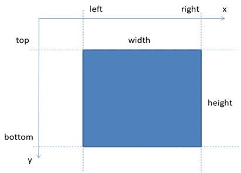
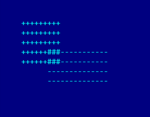

# Лабораторная работа №3. Проектирование собственных классов

- [Лабораторная работа №3. Проектирование собственных классов](#лабораторная-работа-3-проектирование-собственных-классов)
  - [Практические задания](#практические-задания)
  - [Обязательные задания](#обязательные-задания)
    - [Задание 1](#задание-1)
      - [Вариант 1 – Телевизор – 50 баллов](#вариант-1--телевизор--50-баллов)
      - [Вариант 2 – Автомобиль – 140 баллов](#вариант-2--автомобиль--140-баллов)
      - [Вариант 3 – Прямоугольник - 50 баллов](#вариант-3--прямоугольник---50-баллов)
  - [Дополнительные задания](#дополнительные-задания)
    - [Задание 2 – Калькулятор – 300 баллов ](#задание-2--калькулятор--300-баллов-)
  - [Ссылки](#ссылки)

## Практические задания

На оценку «**удовлетворительно**» необходимо набрать **не менее 50 баллов**.

На оценку «**хорошо**» набрать **не менее 300 баллов**.

На оценку «**отлично**» набрать **не менее 600 баллов**.

<span style="color:red">**Внимание, дополнительные задания принимаются только после успешной защиты обязательных заданий.**</span>

## Обязательные задания

### Задание 1

Выполните один из предложенных вариантов задания.

#### Вариант 1 – Телевизор – 50 баллов

Спроектируйте **с использованием TDD или BDD** класс `CTVSet`, моделирующий телевизор, который может находиться либо в выключенном, либо включенном состоянии. Находясь во включенном состоянии, телевизор способен отображать один из 99 каналов (от 1 до 99).

Над телевизором можно выполнять следующие действия:

- Выключить. В выключенном состоянии нельзя переключать каналы.
- Включить. При своем включении телевизор включается на том канале, на котором он был ранее выключен. При самом первом включении телевизор включается на первом канале.
- Выбрать заданный канал (от 1 до 99) или остаться на том же самом канале, если номер канала за пределами данного диапазона.

Телевизор обладает следующими свойствами:

- Включен или выключен
- Номер текущего канала. В выключенном состоянии номер текущего канала должен быть равен нулю.

Разработайте программу, использующую разработанный Вами класс `CTVSet`, которая обрабатывает команды пользователя, вводимые им со стандартного потока ввода:

- **TurnOn**. Включает телевизор, если он был выключен
- **TurnOff**. Выключает телевизор, если он был включен
- **SelectChannel** *<номер канала>*. Выбирает указанный номер канала.
- **Info**. Выводит текущее состояние телевизора (выключен или включен, номер канала).

<span style="color:gray">**Бонус в 10 баллов за возможность переключения на ранее просмотренный канал**</span> <a name="1-1-b-1"></a>

Бонус присуждается за добавление в класс телевизора метода `SelectPreviousChannel()`, выполняющей переключение телевизора на канал, на котором телевизор находился ранее, либо остаться на том же канале. После выключения телевизора информация о ранее предыдущем канале должна сохраняться. Данная операция также доступна только у включенного телевизора.

Интерфейс пользователя должен поддерживать соответствующую команду, вводимую с `stdin`.

<span style="color:gray">**Бонус в 40 баллов за возможность задать имя для канала**</span> <a name="1-1-b-2"></a>

Реализовать возможность задания имени для канала с допустимым номером при помощи метода `SetChannelName(номер канала, имя)`. Именем канала может являться непустая строка. Имя канала может содержать пробелы, но не должно состоять из одних только пробелов. Пробелы в начале и в конце имени канала, а также лишние пробелы в середине должны игнорироваться.

Добавить версию метода `SelectChannel`, принимающую строку, задающую имя канала.

Должна иметься возможность удалить имя канала при помощи метода `DeleteChannelName(имя канала)`, узнать имя канала по его порядковому номеру при помощи метода `GetChannelName(номер канала)`, а также получить номер канала по его имени при помощи метода `GetChannelByName(имя канала)`.

Все эти операции доступны только у **включенного** телевизора.

Если указанное имя уже было закреплено за другим каналом, то происходит смена ассоциации. Если за текущим каналом ранее было закреплено другое имя, то старая ассоциация должна быть удалена. Иными словами, с каждым каналом может быть связано не более одного имени. Одному имени может соответствовать только один канал.

Интерфейс пользователя предоставлять возможность задавать и удалять имена каналов, переключать каналы при помощи `SelectChannel` не только по номеру, но и имени. Обновить формат вывода команды `Info`, чтобы выводился еще и список каналов, с которыми ассоциированы имена, отсортированный в порядке возрастания номера канала:

```txt
1 – ОРТ
17 – Discovery
35 – Русский экстрим
```

#### Вариант 2 – Автомобиль – 140 баллов

Разработать класс `Car`, моделирующий автомобиль в следующей предметной области. Для разработанного класса должны быть также разработаны модульные тесты.

Двигатель автомобиля может находиться как во включенном состоянии, так и в выключенном.

В автомобиле может быть включена одна из следующих передач:

- Задний ход (-1)
- Нейтральная передача (0)
- Первая передача (1)
- Вторая передача (2)
- Третья передача (3)
- Четвертая передача (4)
- Пятая передача (5)

Каждая передача автомобиля имеет свой диапазон скоростей.

<table>
    <thead>
        <tr>
            <th>Передача</th>
            <th>Диапазон скоростей</th>
        </tr>
    </thead>
    <tbody>
        <tr>
            <th>Задний ход</th>
            <th>0 – 20</th>
        </tr>
        <tr>
            <th>Нейтраль</th>
            <th>Без ограничений</th>
        </tr>
        <tr>
            <th>Первая</th>
            <th>0 – 30</th>
        </tr>
        <tr>
            <th>Вторая</th>
            <th>20 – 50</th>
        </tr>
        <tr>
            <th>Третья</th>
            <th>30 – 60</th>
        </tr>
        <tr>
            <th>Четвертая</th>
            <th>40 – 90</th>
        </tr>
        <tr>
            <th>Пятая</th>
            <th>50 – 150</th>
        </tr>
    </tbody>
</table>

На каждой передаче можно развить скорость в пределах отведенного данной передаче диапазона. **Исключение – нейтральная передача**, на которой скорость можно изменить **только уменьшить (по модулю)**.

**При включенном двигателе** переключиться можно с любой передачи на любую при условии, что текущая скорость автомобиля находится в диапазоне скоростей новой передачи, и направление движения автомобиля допускает включение данной передачи. Например:

- на задний ход можно переключиться только **на нулевой скорости**; даже при движении назад на нейтральной передаче не допускается включать заднюю передачу.
- с заднего хода можно переключиться на переднюю передачу **только на нулевой скорости**;
- переключившись на заднем ходу на нейтральную передачу на ненулевой скорости, переключиться на переднюю передачу **можно только после остановки**

Двигатель данного автомобиля может быть **выключен** только при **нулевой** скорости на **нейтральной** передаче. При выключенном двигателе переключиться можно только на нейтральную передачу. Как следствие, автомобиль **после включения двигателя** находится на **нейтральной** передаче **в состоянии покоя**.

Автомобиль обладает следующими свойствами:
- Состояние двигателя (включен или выключен) – метод `IsTurnedOn()`
- Направление движения (вперед, назад или стоим на месте) – метод `GetDirection()`
- Текущая скорость движения (целое число от 0 до максимальной скорости) – метод `GetSpeed()`
- Текущая выбранная передача [-1..5] – метод `GetGear()`

Автомобиль может выполнять следующие действия:

- Включить двигатель (если он выключен). Возвращает `true`, если двигатель включился (или уже был включен).

```c++
bool TurnOnEngine()
```

- Выключить двигатель (если он включен и текущая передача – нейтральная, а автомобиль стоит). Возвращает true, если двигатель был успешно выключен (или уже был выключен), и false, если двигатель не может быть в данный момент выключен.

```c++
bool TurnOffEngine() 
```

- Выбрать указанную передачу [-1..5]. В случае успешного переключения передачи (в том числе и на саму себя) возвращает true.

```c++
bool SetGear(int gear) 
```

- Задать указанную скорость. Возвращает true, если скорость удалось изменить и false, если изменить скорость движения на указанную невозможно (например, на нейтральной передаче нельзя разогнаться).

```c++
bool SetSpeed(int speed) 
```

На основе данного класса разработать приложение, позволяющее пользователю управлять виртуальным автомобилем при помощи следующих команд, вводимых со стандартного потока ввода:

- `Info`. Выводит состояние двигателя автомобиля, направление движения, скорость и передачу:
  - Передача выводится в виде числа от -1 до 5
  - Скорость выводится по модулю. Например, при движении задом скорость должна выводиться в виде неотрицательного числа.
  - Состояние двигателя должно выводиться в виде «on» либо «off», либо на русском языке.
  - Направление движения выводится в виде: «forward», «backward» или «standing still», либо на русском языке.
- `EngineOn`. Включает двигатель
- `EngineOff`. Выключает двигатель
- `SetGear` передача. Включает заданную передачу, заданную числом от -1 до 5. В случае ошибки сообщает почему невозможно переключить передачу.
- `SetSpeed` скорость. Устанавливает указанную скорость движения, заданную неотрицательным числом. В случае невозможности изменения скорости сообщает, почему нельзя изменить скорость на указанную.

#### Вариант 3 – Прямоугольник - 50 баллов

Разработайте **с использованием TDD** класс CRectangle, моделирующий сущность «Прямоугольник».

Прямоугольник обладает следующими свойствами (т.к. в C++ отсутствует поддержка свойств, следует вместо них использовать соответствующие `Get*` и `Set*` методы.) (не путать с членами-данными (используйте тот набор переменных-членов класса, который необходим и достаточен для реализации упомянутых свойств)):

- Ширина (width), доступна как для чтения, так и для записи
- Высота (height), доступна как для чтения, так и для записи
- Координата X левого края (Left), доступна как для чтения, так и для записи
- Координата Y верхнего края (Top), доступна как для чтения, так и для записи
- Координата X правого края (Right), доступна как для чтения, так и для записи
- Координата Y нижней стороны (Bottom), доступна как для чтения, так и для записи
- Площадь (Area), доступна только для чтения
- Периметр (Perimeter), доступен только для чтения

Координаты и размеры прямоугольника **задаются целыми числами**.

Ширина и высота

Размеры (ширина и высота) прямоугольника не могут быть отрицательными (конструкторе и set-методах следует заменять отрицательные размеры на 0).



Конструктор данного класса принимает координаты левого верхнего угла прямоугольника, а также его ширину и высоту.

Над прямоугольником можно выполнить следующие действия:
- Перенести вдоль заданного вектора на dx и dy, не изменяя размеров прямоугольника

```c++
void Move(int dx,int dy) 
```

- Отмасштабировать прямоугольник с использованием масштабных коэффициентов sx и sy. При масштабировании координаты левого верхнего угла прямоугольника остаются без изменения, а изменяется только его размер. Если sx или sy является отрицательным числом, то масштабирования не происходит

```c++ 
void Scale(int sx, int sy) 
```

- Найти пересечение данного прямоугольника с другим прямоугольником. Данный метод возвращает `true`, если прямоугольники пересекаются, и изменяет характеристики текущего прямоугольника. Если прямоугольники не пересекаются, то данный метод возвращает `false` и сбрасывает ширину и высоту прямоугольника в 0 (координаты верхнего левого угла остаются без изменений).

```c++
bool Intersect(CRectangle const& other) 
```

Разработать на основе данного класса программу, выполняющую считывание двух текстовых файлов, имена которых передаются программе через параметры командной строки, содержащих произвольное количество команд (по одной команде в каждой строке), управляющих размерами и трансформациями двух прямоугольников.

- `Rectangle <left> <top> <width> <height>`. Инициализирует текущий прямоугольник указанными координатами и размерами.
- `Move <dx> <dy>`. Переносит текущий прямоугольник вдоль заданного вектора, не изменяя его размеров
- `Scale <sx> <sy>`. Масштабирует (увеличивает в указанное количество раз ширину и высоту) текущий прямоугольник с использованием масштабных коэффициентов относительно его верхнего левого угла

До первого появления команды Rectangle в файле текущий прямоугольник **имеет нулевые размеры и нулевые координаты верхнего левого угла**.

После выполнения команд, задаваемых в текстовых файлах программа должна вывести в стандартный поток вывода координаты и размеры прямоугольников после применения указанных преобразований, их периметр и площадь, а также результат их пересечения в следующем формате:

```txt
Rectangle 1:
    Left top: (<left1>; <top1>)
    Size: <width1>*<height1>
    Right bottom: (<right1>; <bottom1>)
    Area: <area1>
    Perimeter: <perimeter1>
Rectangle 2:
    Left top: (<left2>; <top2>)
    Size: <width2>*<height2>
    Right bottom: (<right2>; <bottom2>)
    Area: <area2>
    Perimeter: <perimeter2>
Intersection rectangle:
    Left top: (<left>; <top>)
    Size: <width>*<height>
    Right bottom: (<right>; <bottom>)
    Area: <area>
    Perimeter: <perimeter>
```

<span style="color:gray">**Бонус  в 50 баллов за визуализацию исходных прямоугольников и результата их пересечения**</span> <a name="1-3-b-1"></a>

Разработайте класс `CCanvas`, моделирующий прямоугольное растровое полотно для рисования в текстовом режиме, а также метод `FillRectangle`, выполняющий закрашивание области, соответствующей прямоугольнику на данном полотне.

Каркас класса `CCanvas` представлен ниже:

```c++
/*
 Класс, моделирующий сущность Canvas (полотно, холст для рисования, картинка, канва),
 хранящую прямоугольный массив пикселей. Для каждого пикселя изображения можно задать
 свой код символа, что позволяет выводить простейшие картинки в текстовом режиме, вроде таких:

  +----+
 /    /|
+----+ |
|    | +
|    |/
+----+
*/
class CCanvas
{
public:
    // Создает канву для рисования размером width*height
    // После своего создания содержимое канвы заполнено пробельными символами
    // Допускается создание канвы нулевых размеров
    CCanvas(unsigned width, unsigned height);

     // Возвращает ширину канвы
     unsigned GetWidth()const;

     // Возвращает высоту канвы
     unsigned GetHeight()const;

     // Очищает канву (заполняет содержимое символами с указанным кодом)
     // Если код символа находится в диапазоне от 0 до ' ', команда игнорируется
     void Clear(char code = ' ');

     // Задает код символа code для пикселя в координатах (x, y)
     // Координаты верхнего левого угла канвы принимаются равными 0, 0.
     // Если координаты выходят за пределы канвы, либо код символа 
     // находится в диапазоне от 0 до (' ' - 1), содержимое канвы не должно меняться
     void SetPixel(int x, int y, char code);

     // Возвращает код символа пикселя в координатах (x, y)
     // Координаты верхнего левого угла канвы принимаются равными 0, 0.
     // Если координаты пикселя выходят за пределы канвы, должен возвращаться
     // код символа "пробел"
     char GetPixel(int x, int y)const;

     // Выводит содержимое в поток вывода, производный от std::ostream 
     // (например, std::cout, экземпляр ofstream, или ostringstream)
     // В конце каждой строки должен выводиться символ \n
     void Write(std::ostream & ostream)const;
private:
    // Закрытые данные и методы класса
};
```

Объявление функции FillRectangle представлено ниже

```c++
// Заполняет пиксели, соответствующие прямоугольнику rect в канве,
// символом с кодом code
void FillRectangle(CRectangle const& rect, char code, CCanvas & canvas);
```

Первый прямоугольник должен быть отображен при помощи символов “`+`”, второй – при помощи символа “`-`“, а результат их пересечения – при помощи символа “`#`”. На следующем рисунке показан ожидаемый результат работы программы при следующих входных данных:

- Прямоугольник 1. Left: 5, Top: 2, Width: 9, Height: 5
- Прямоугольник 2. Left: 11, Top: 5, Width: 14, Height: 4



Программа должна вывести визуальный результат пересечения прямоугольников в файл, имя которого передано в качестве 3-го аргумента командной строки, а при отсутствии 3-го аргумента – в стандартный поток вывода (сразу после текстовой информации, указанной в обязательной части задания). В обоих случаях принят размер полотна для рисования равным 60 * 20.

## Дополнительные задания

### Задание 2 – Калькулятор – 300 баллов <a name="2"></a>

Разработать **с использованием подхода TDD** программу «Калькулятор», позволяющую выполнять простейшие арифметические операции над переменными и пользовательскими функциями. Спроектируйте классы, моделирующих основные сущности предметной области, и напишите для них тесты.

<span style="color:gray">**Формат входных и выходных данных**</span> <a name="2-io-format"></a>

Входные данные поступают из `stdin`. Работа программы завершается при обнаружении конца файла.  Каждая строка содержит одну из следующих команд:

- `var <идентификатор>`

  **Объявляет переменную** типа double с именем <идентификатор>. Идентификатор **не должен совпадать** ни с одним из **ранее объявленных** имен переменных и функций. Значение переменной после ее объявления не определено (можно использовать значение `NAN` для этих целей). В отсутствие ошибок в `stdout` ничего не выводится. При наличии ошибки команда игнорируется, а в `stdout` выводится текст ошибки.
- `let <идентификатор1> = <число с плавающей запятой>` либо

  `let <идентификатор1> = <идентификатор2>`.

  Присваивает **переменной** с именем *<идентификатор1>* числовое значение, либо **текущее значение ранее объявленного** идентификатора с именем *<идентификатор2>*. Если переменная с именем *<идентификатор1>* не была ранее объявлена, происходит объявление новой переменной. В качестве *<идентификатора1>* не может выступать имя функции. В отсутствие ошибок в `stdout` ничего не выводится.  В случае ошибки команда игнорируется, а в `stdout` выводится текст ошибки.
- `fn <идентификатор1> = <идентификатор2>` либо

  `fn <идентификатор1> = <идентификатор2><операция><идентификатор3>`

  Объявляет новую функцию с ранее **необъявленным именем** *<идентификатор1>*, значением которой будет либо значение идентификатора *<идентификатор2>*, либо результат применения одной из следующих бинарных операций к значениям **ранее объявленных** идентификаторов *<идентификатор2>* и *<идентификатор3>* **в момент вычисления значения функции**:
  - `+`. Сложение.
  - `-`. Вычитание.
  - `*`. Умножение
  - `/`. Деление

  Если значение хотя бы одного из операндов операции не определено, результатом операции должно быть неопределенное значение. В отсутствие ошибок в `stdout` ничего не выводится. В случае ошибки команда игнорируется, а в `stdout` выводится текст ошибки.

- `print <идентификатор>`

  Выводит в `stdout` значение **ранее объявленного** идентификатора. Если идентификатором являлась переменная, то выводится ее значение, а если функция, то выводится вычисленное значение функции. **Значение идентификатора выводится с точностью в 2 знака** после запятой. В случае, когда значение идентификатора не определено, должно быть выведено **nan**. В случае ошибки (например, попытка вывести значение необъявленного идентификатора), команда игнорируется, а в `stdout` должен быть выведен текст ошибки.
- `printvars`

  Выводит в `stdout` имена и значения всех ранее объявленных переменных, **отсортированных по алфавиту**, по одному в каждой строке в следующем формате:

  `<идентификатор>:<значение>`

  Значение переменной выводится с точностью **2 знака после запятой**. Если значение переменной не определено, должно быть выведено **nan**. Если ни одной переменной не было объявлено к моменту выполнения команды `printvars`, в `stdout` выводиться ничего не должно.
- `printfns`

  Выводит в `stdout` имена и значения всех ранее объявленных функций, **отсортированных по алфавиту**, по одному в каждой строке в следующем формате:

  **<идентификатор>:<значение>**

  Значение функции выводится с точностью в **2 знака после запятой**. Если значение функции не определено, должно быть выведено **nan**. Если ни одной функции не было объявлено к моменту выполнения команды `printfns`, в `stdout` выводиться ничего не должно

**Идентификатором** является непустая строка, в которой допускается использовать буквы английского алфавита, цифры и символ подчеркивания. Идентификатор не может начинаться с цифры. Идентификаторы используются в качестве имен переменных и функций.

Идентификаторы и названия команд являются **чувствительными к регистру символов**.

<span style="color:gray">**Примеры**</span> <a name="2-examples"></a>

<span style="color:gray">***Объявление, присваивание и вывод значений переменных***</span>

<table>
     <thead>
          <tr>
               <th>stdin</th>
               <th>stdout</th>
               <th>Пояснение</th>
          </tr>
     </thead>
     <tbody>
          <tr>
               <th>var x</th>
               <th></th>
               <th></th>
          </tr>
          <tr>
               <th>print x</th>
               <th>nan</th>
               <th>Значение переменной x пока не определено</th>
          </tr>
          <tr>
               <th>let x=42</th>
               <th></th>
               <th>Присваиваем переменной x значение 42</th>
          </tr>
          <tr>
               <th>print x</th>
               <th>42.00</th>
               <th></th>
          </tr>
          <tr>
               <th>let x=1.234</th>
               <th></th>
               <th>Значение переменной можно изменить</th>
          </tr>
          <tr>
               <th>print x</th>
               <th>1.23</th>
               <th>Значение выводится с точностью 2 знака после запятой</th>
          </tr>
          <tr>
               <th>let y=x</th>
               <th></th>
               <th>Автоматически объявляем переменную y и присваиваем ей текущее значение x</th>
          </tr>
          <tr>
               <th>let x=99</th>
               <th></th>
               <th></th>
          </tr>
          <tr>
               <th>printvars</th>
               <th>x:99.00
                   <br>y:1.23</th>
               <th>Переменная y хранит присвоенное ей значение x. Последующие манипуляции над x не оказывают на нее влияния.</th>
          </tr>
     </tbody>
</table>

<span style="color:gray">***Объявление функций***</span>

<table>
     <thead>
          <tr>
               <th>stdin</th>
               <th>stdout</th>
               <th>Пояснение</th>
          </tr>
     </thead>
     <tbody>
          <tr>
               <th>var x</th>
               <th></th>
               <th></th>
          </tr>
          <tr>
               <th>var y</th>
               <th></th>
               <th></th>
          </tr>
          <tr>
               <th>fn XPlusY=x+y</th>
               <th></th>
               <th></th>
          </tr>
          <tr>
               <th>print XPlusY</th>
               <th>nan</th>
               <th>Значение функции не определено, т.к. не определены значения ее аргументов</th>
          </tr>
          <tr>
               <th>let x=3</th>
               <th></th>
               <th></th>
          </tr>
          <tr>
               <th>let y=4</th>
               <th></th>
               <th></th>
          </tr>
          <tr>
               <th>print XPlusY</th>
               <th>7.00</th>
               <th>Теперь значение функции определено</th>
          </tr>
          <tr>
               <th>let x=10</th>
               <th></th>
               <th></th>
          </tr>
          <tr>
               <th>print XPlusY</th>
               <th>14.00</th>
               <th>Значение функции зависит от значений ее аргументов</th>
          </tr>
          <tr>
               <th>let z=3.5</th>
               <th></th>
               <th></th>
          </tr>
          <tr>
               <th>fn XPlusYDivZ=XPlusY/z</th>
               <th></th>
               <th>Значение функции может зависеть не только от значений переменных, но и от значений других функций</th>
          </tr>
          <tr>
               <th>printfns</th>
               <th>XPlusY:14.00
                   <br>XPlusYDivZ:4.00</th>
               <th>Значения функций выводятся в алфавитном порядке</th>
          </tr>
     </tbody>
</table>

<span style="color:gray">***Еще раз про различие между fn и let***</span>

<table>
     <thead>
          <tr>
               <th>Stdin</th>
               <th>stdout</th>
               <th>Пояснение</th>
          </tr>
     </thead>
     <tbody>
          <tr>
               <th>let v=42</th>
               <th></th>
               <th></th>
          </tr>
          <tr>
               <th>let variable=v</th>
               <th></th>
               <th>variable хранит значение v (42)</th>
          </tr>
          <tr>
               <th>fn function=v</th>
               <th></th>
               <th>function хранит действие, которое будет вычислено при получении значения функции</th>
          </tr>
          <tr>
               <th>let v=43</th>
               <th></th>
               <th></th>
          </tr>
          <tr>
               <th>print variable</th>
               <th>42.00</th>
               <th></th>
          </tr>
          <tr>
               <th>print function</th>
               <th>43.00</th>
               <th>Значением function будет значение переменной v, вычисленное в момент вызова функции (а не ее объявления)</th>
          </tr>
     </tbody>
</table>

<span style="color:gray">***Вычисление площади круга***</span>

<table>
     <thead>
          <tr>
               <th>Stdin</th>
               <th>stdout</th>
               <th>Пояснение</th>
          </tr>
     </thead>
     <tbody>
          <tr>
               <th>var radius</th>
               <th></th>
               <th></th>
          </tr>
          <tr>
               <th>let pi=3.14159265</th>
               <th></th>
               <th></th>
          </tr>
          <tr>
               <th>fn radiusSquared=radius*radius</th>
               <th></th>
               <th></th>
          </tr>
          <tr>
               <th>fn circleArea=pi*radiusSquared</th>
               <th></th>
               <th></th>
          </tr>
          <tr>
               <th>let radius=10</th>
               <th></th>
               <th></th>
          </tr>
          <tr>
               <th>print circleArea</th>
               <th>314.16</th>
               <th></th>
          </tr>
          <tr>
               <th>let circle10Area=circleArea</th>
               <th></th>
               <th>circle10Area хранит значение функции circleArea, вычисленной при radius=10</th>
          </tr>
          <tr>
               <th>let radius=20</th>
               <th></th>
               <th></th>
          </tr>
          <tr>
               <th>let circle20Area=circleArea</th>
               <th></th>
               <th>circle20Area хранит значение функции circleArea, вычисленной при radius=20</th>
          </tr>
          <tr>
               <th>printfns</th>
               <th>circleArea:1256.64
                   <br>radiusSquared:400.00</th>
               <th></th>
          </tr>
          <tr>
               <th>printvars</th>
               <th>circle10Area:314.16
                   <br>circle20Area:1256.64
                   <br>pi:3.14
                   <br>radius:20.00</th>
               <th></th>
          </tr>
     </tbody>
</table>

<span style="color:gray">***Вычисление последовательности Фибоначчи***</span>

<table>
     <thead>
          <tr>
               <th>Stdin</th>
               <th>stdout</th>
               <th>Пояснение</th>
          </tr>
     </thead>
     <tbody>
           <tr>
               <th>let v0=0</th>
               <th></th>
               <th></th>
          </tr>
          <tr>
               <th>let v1=1</th>
               <th></th>
               <th></th>
          </tr>
          <tr>
               <th>fn fib0=v0</th>
               <th></th>
               <th></th>
          </tr>
          <tr>
               <th>fn fib1=v1</th>
               <th></th>
               <th></th>
          </tr>
          <tr>
               <th>fn fib2=fib1+fib0</th>
               <th></th>
               <th></th>
          </tr>
          <tr>
               <th>fn fib3=fib2+fib1</th>
               <th></th>
               <th></th>
          </tr>
          <tr>
               <th>fn fib4=fib3+fib2</th>
               <th></th>
               <th></th>
          </tr>
          <tr>
               <th>fn fib5=fib4+fib3</th>
               <th></th>
               <th></th>
          </tr>
          <tr>
               <th>fn fib6=fib5+fib4</th>
               <th></th>
               <th></th>
          </tr>
          <tr>
               <th>printfns</th>
               <th>fib0:0.00
                   <br>fib1:1.00
                   <br>fib2:1.00
                   <br>fib3:2.00
                   <br>fib4:3.00
                   <br>fib5:5.00
                   <br>fib6:8.00</th>
               <th></th>
          </tr>
          <tr>
               <th>let v0=1</th>
               <th></th>
               <th></th>
          </tr>
          <tr>
               <th>let v1=1</th>
               <th></th>
               <th></th>
          </tr>
          <tr>
               <th>printfns</th>
               <th>fib0:1.00
                   <br>fib1:1.00
                   <br>fib2:2.00
                   <br>fib3:3.00
                   <br>fib4:5.00
                   <br>fib5:8.00
                   <br>fib6:13.00</th>
               <th></th>
          </tr>
     </tbody>
</table>

<span style="color:gray">**Бонус в 200 баллов за оптимизацию вычислений функций**</span> <a name="2-b-1"></a>

Наивный подход к вычислению значений функций может в ряде случаев приводить к экспоненциальной вычислительной сложности. Например, попытка вычислить значение хотя бы 50-го числа последовательности Фибоначчи, заданного в виде «рекурсивной» последовательности функций, потребует весьма продолжительного времени. Придумайте способ, позволяющий значительно сократить вычислительную сложность алгоритма в таких ситуациях.

<span style="color:gray">**Бонус в 100 баллов за возможность вычисления очень больших последовательностей функций**</span> <a name="2-b-2"></a>

Использование рекурсии в процессе вычислений функций с большой глубиной вычислений (десятки или сотни тысяч) может привести к переполнению стека (win32-приложениям по умолчанию доступно около 2МБ стека). Придумайте способ решить проблему с переполнением стека из-за глубокой рекурсии, не изменяя размер стека в настройках компоновщика.

Пример входных данных, которые потенциально могут приводить к указанной проблеме:

<table>
     <thead>
          <tr>
               <th>stdin</th>
               <th>stdout</th>
               <th>Пояснение</th>
          </tr>
     </thead>
     <tbody>
          <tr>
               <th>let x=1
                   <br>fn x2=x+x
                   <br>fn x3=x2+x
                   <br>fn x4=x3+x
                   <br>fn x5=x3+x
                   <br>…
                   <br>fn x1000000=x999999+x</th>
               <th></th>
               <th>Объявляется большая последовательность функций, каждая из которых прибавляет x к значению предыдущей функции.</th>
          </tr>
          <tr>
               <th>print x1000000</th>
               <th>1000000.00</th>
               <th>Наивное рекурсивное вычисление функции x1000000 может привести к переполнению стека.</th>
          </tr>
          <tr>
               <th>let x=2</th>
               <th></th>
               <th></th>
          </tr>
          <tr>
               <th>print x1000000</th>
               <th>2000000.00</th>
               <th></th>
          </tr>
     </tbody>
</table>

## Ссылки

1. [Разработка через тестирование](https://ru.wikipedia.org/wiki/Разработка_через_тестирование)
