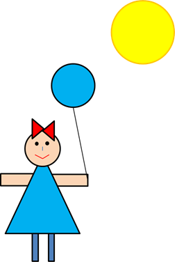

# Лабораторная работа №4. Композиция, наследование, полиморфизм

- [Лабораторная работа №4. Композиция, наследование, полиморфизм](#лабораторная-работа-4-композиция-наследование-полиморфизм)
  - [Практические задания](#практические-задания)
  - [Обязательные задания](#обязательные-задания)
    - [Задание 1](#задание-1)
      - [Вариант 1 – 120 баллов](#вариант-1--120-баллов)
      - [Вариант 2 – 100 баллов](#вариант-2--100-баллов)

## Практические задания

На оценку «**удовлетворительно**» необходимо выполнить **все обязательные задания** и набрать **не менее 60 баллов**.

На оценку «**хорошо**» необходимо выполнить все обязательные и часть дополнительных заданий и набрать **не менее 110 баллов**.

На оценку «**отлично**» необходимо выполнить все обязательные и часть дополнительных заданий и набрать **не менее 250 баллов**.

**Внимание, дополнительные задания принимаются только после успешной защиты обязательных заданий**.

## Обязательные задания

### Задание 1

#### Вариант 1 – 120 баллов

Разработайте классы следующей иерархии объемных тел (для устранения дублирования кода может потребоваться вынесение одинаковой реализации методов простых тел в дополнительный базовый класс (например, CSolidBody)):


Каждое объемное тело обладает некоторым объемом, однородной плотностью и массой. Исключение составляет класс `CCompound`, моделирующий составное тело, состоящее из нескольких непересекающихся объемных тел, плотность которого не является однородной. Средняя плотность составного тела может быть вычислена как отношение массы составляющих его тел к их суммарному объему.

**Масса простого тела** вычисляется через произведение его плотности и объема. **Масса составного тела** вычисляется через массу составляющих его частей.

При реализации метода добавления тела внутрь составного тела необходимо обрабатывать ситуацию с возможным зацикливанием, т. е. прямым или опосредованным добавлением составного объекта внутрь себя самого.

Программа должна считывать информацию об имеющемся наборе объемных тел из стандартного потока ввода (предусмотреть возможность ввода информации о составных объемных телах) и сохранять их в vector (в данном случае контейнер vector должен хранить указатели на CBody. Лучше всего воспользоваться умными указателями типа std::shared_ptr (boost::shared_ptr при его отсутствии), unique_ptr или контейнером boost::ptr_vector). Для простых тел пользователь вводит геометрические размеры фигуры и её плотность. Объем и массу тела программа должна вычислять самостоятельно. Для составных тел пользователь должен параметры вводимых тел внутри составного. Предусмотреть возможность произвольной глубины составных тел друг в друга.

В программе должна быть выделена функция, позволяющая найти тело **с наибольшей массой**, а также функция, позволяющая найти тело, которое будет **легче всего весить, будучи полностью погруженным в воду** (легче всего в воде будет весить тело, для которого величина $F_{тяжести}-F_{архимеда}$=($ρ_{тела}-ρ_{воды}$)gV будет минимальной. Это не обязательно будет тело с наименьшей массой, плотность воды принять равной 1000 кг/м3). Предполагается, что все тела, в том числе и всплывающие в воде, можно полностью погрузить в воду, чтобы узнать их вес в воде.

После ввода всех фигур программа должна вывести подробную информацию обо всех телах (составные тела должны выводить подробную информацию о содержащихся в них дочерних телах). Отдельно вывести информацию о теле с наибольшей массой, а также о теле, которое меньше всего весит в воде.

<span style="color:red">Возможна сдача работы без поддержки составных объемных тел. В этом случае работа будет принята с коэффициентом 0,7.</span>

**В комплекте с программой должны обязательно поставляться файлы, позволяющие проверить ее работу автоматически**. Без них работа будет принята с коэффициентом 0.6 (коэффициент применяется к остальным коэффициентам).

#### Вариант 2 – 100 баллов

Разработайте классы и интерфейсы следующей иерархии геометрических фигур:


С их использованием разработайте программу, считывающую информацию из стандартного потока ввода команды, описывающие фигуры в некотором текстовом формате (придумайте сами). Например, таком:

```txt
rectangle 10.3 20.15 30.7 40.4 ff0000 00ff00
```

Данная команда описывает прямоугольник с координатами верхнего левого угла (10.3, 20.15), шириной 30.7 и высотой 40.4, с красной обводкой (#ff0000) и зеленой заливкой внутренней области (#00ff00). Аналогичным образом могут быть описаны команды для задания остальных фигур.

Во входном потоке может быть произвольное количество фигур (считывать до `EOF`).

Считанные фигуры должны быть сохранены в массиве в порядке их считывания.

В программе должна быть функция, позволяющая найти среди массива фигур ту, которая имеет наибольшую площадь, а также функция, позволяющая найти фигуру, имеющую наименьший периметр. После окончания считывания фигур программа должна вывести в стандартный поток вывода информацию об этих двух фигурах. При этом должна быть выведена полная информация, включающая в себя:

- Площадь и периметр фигуры
- Цвет обводки и заливки (при наличии)
- Данные, специфичные для конкретной фигуры (для этого удобно использовать `ToString()`)

**В комплекте с программой должны обязательно поставляться файлы, позволяющие проверить ее работу автоматически**. Без них работа будет принята с коэффициентом 0.6.

<span style="color:gray">**Бонус в 200 баллов за визуализацию фигур**</span> <a name="1-2-b-1"></a>

Для получения бонуса добавьте в иерархию фигур возможность рисования на холсте, представленном интерфейсом `ICanvas`. Для этого фигуры должны реализовывать интерфейс `ICanvasDrawable`.


Для рисования разработайте класс `CCanvas`, реализующий интерфейс `ICanvas` с некоторого (на Ваш выбор) графического API (GDI, OpenGL, SFML, SDL и т.п.). Фигуры визуализируются в порядке, в котором они были введены пользователем.

**Метод Draw, реализуемый фигурами должна быть также покрыта тестами (без них будет применен коэффициент 0,6)**. Для этого в тестах используйте реализацию интерфейса `ICanvas`, которая вместо фактического рисования позволила бы запротоколировать рисуемые фигурой примитивы для последующего сравнения в тестах с ожидаемыми значениями. Для облегчения создания такой реализации рекомендуется воспользоваться одним из имеющихся библиотек для создания mock-объектов. Хорошим примером такой библиотеки для языка C++ является **FakeIt**, доступный в github-репозитории:

<https://github.com/eranpeer/FakeIt>

В комплекте с программой должен поставляться текстовый файл (или файлы), содержащий описания фигур в формате, понятном программе. При запуске программы с перенаправлением содержимого этого файла в `stdin`, она должна нарисовать закодированное изображение. При этом картинка, полученная при визуализации этого файла должна представлять из себя некоторое законченное произведение, а не быть случайно разбросанными фигурами. Например, вроде такого:


