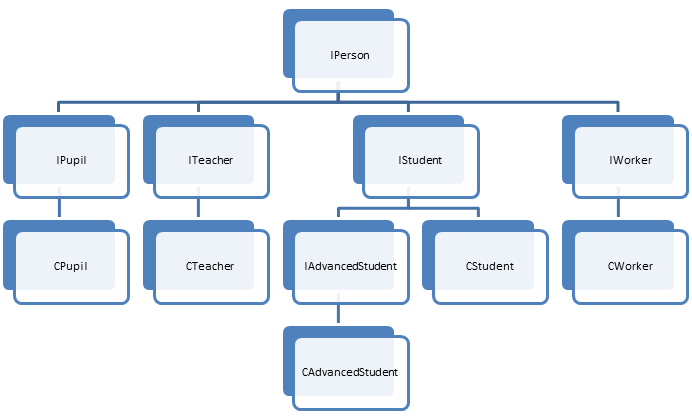
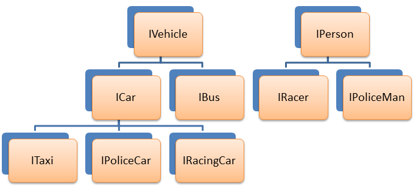
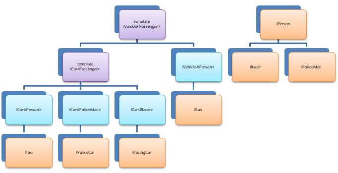
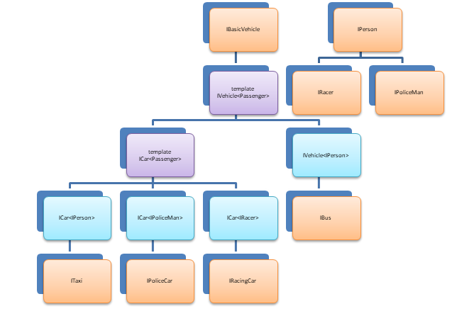
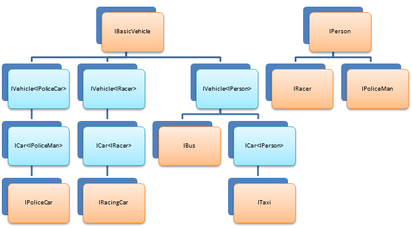
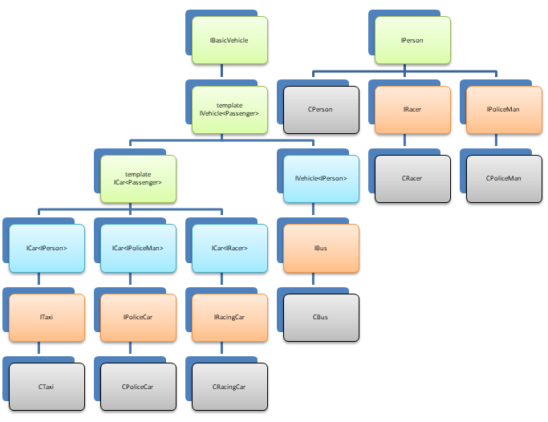
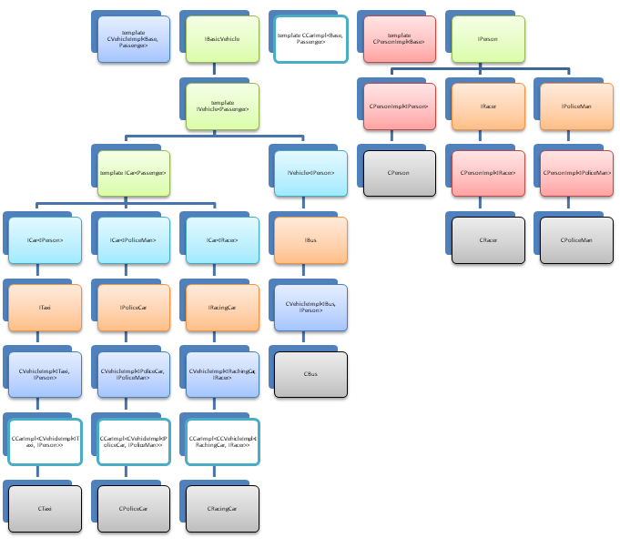

# Лабораторная работа №7. Обобщенное программирование, шаблоны

- [Лабораторная работа №7. Обобщенное программирование, шаблоны](#лабораторная-работа-7-обобщенное-программирование-шаблоны)
  - [Практические задания](#практические-задания)
  - [Обязательные задания](#обязательные-задания)
    - [Задание 1](#задание-1)
      - [Вариант 1. 10 баллов – Sort2](#вариант-1-10-баллов--sort2)
      - [Вариант 2. 20 баллов - FindMax](#вариант-2-20-баллов---findmax)
    - [Вариант 3. 30 баллов - FindMaxEx](#вариант-3-30-баллов---findmaxex)
      - [Вариант 4. 20 баллов. - ArraySum](#вариант-4-20-баллов---arraysum)
    - [Задание 2](#задание-2)
      - [Вариант 1 – 150 баллов - CMyArray](#вариант-1--150-баллов---cmyarray)
      - [Вариант 2 – 80 баллов - CMyStack](#вариант-2--80-баллов---cmystack)
      - [Вариант 3 – 150 баллов - CMyList](#вариант-3--150-баллов---cmylist)
  - [Дополнительные задания](#дополнительные-задания)
    - [Задание 3](#задание-3)
      - [Вариант 1. 100 баллов - People](#вариант-1-100-баллов---people)
      - [Вариант 2. 120 баллов - Vehicle](#вариант-2-120-баллов---vehicle)

## Практические задания

На оценку «**удовлетворительно**» необходимо набрать **не менее 80 баллов**.

На оценку «**хорошо**» необходимо набрать **не менее 150 баллов**.

На оценку «**отлично**» необходимо набрать **не менее 300 баллов**.

## Обязательные задания

### Задание 1

#### Вариант 1. 10 баллов – Sort2

Разработайте шаблонную функцию `Sort2`, выполняющую упорядочивание своих аргументов, переданных ей по ссылке, в порядке возрастания:

```c++
template <typename T>
void Sort2(T & first, T & second)
```

Разработайте специализированную версию данной шаблонной функции, выполняющую упорядочивание двух аргументов типа `const char` в лексикографическом порядке:

```c++
template <>
void Sort2<const char*>(const char* & first, const char* & second)
```

Продемонстрируйте работу данной функции на примере программы, выполняющей упорядочивание двух строк, двух чисел с плавающей запятой, **трех** целых чисел, а также двух указателей типа `const char*`. Входные данные программы поступают со стандартного потока ввода (не забудьте вывести пояснение для пользователя, например «Enter two integers:»).

Проиллюстрировать работу программы по упорядочиванию указателей типа `const char*` можно, например, так:

```c++
string s1, s2;

// Считываем строки в переменные s1 и s2
getline(s1);
getline(s2);

// Получаем указатели на хранящиеся в строках массивы символов
const char* p1 = s1.c_str();
const char* p2 = s2.c_str();

// Упорядочиваем указатели в лексикографическом порядке
Sort2(p1, p2);

// Выводим результат output
cout << p1 << "\n" << p2 << "\n";
```

#### Вариант 2. 20 баллов - FindMax

Разработайте шаблонную функцию `FindMax`, выполняющую поиск максимального элемента в массиве. В случае, если такой элемент присутствует (массив не пустой), то значение максимального элемента должно быть занесено в аргумент `maxValue`, передаваемый по ссылке, а сама функция вернуть значение «истина». Если массив был пустым, функция должна вернуть значение «ложь».

Прототип функции FindMax:

```c++
template < typename T >
bool FindMax(std::vector<T> const& arr, T& maxValue)
```

Продемонстрируйте работу данной функции для поиска максимального элемента в массиве  целых чисел, массиве чисел с плавающей запятой, а также элементов типа `std::string`.

Разработайте специализированную версию данной функции, выполняющую поиск максимального элемента в массиве `const char*`, интерпретируемых как строки символов, а не обычные указатели.

Продемонстрируйте работу данной функции для нахождения максимального элемента в массиве указателей на строки.

```c++
template <>
bool FindMax<const char *>(std::vector<const char*> const& arr,
                            const char * & maxValue)
```

Внимание, необходимо обосновать предоставление Вашей реализацией функции `FindMax` гарантий строгой безопасности исключений, а также поддержи семантики выполнения «commit-or-rollback».

### Вариант 3. 30 баллов - FindMaxEx

Разработайте функцию `FindMaxEx`, являющуюся расширенной версией функции `FindMax` и позволяющую задавать критерий сравнения элементов при помощи дополнительного параметра `less`:

```c++
template < typename T, typename Less>
bool FindMax(std::vector<T> const& arr, T& maxValue, Less const& less)
```

Предикат `Less` – функция или функтор, принимающий 2 аргумента типа T и возвращающая `true`, если левый аргумент предшествует правому, в противном случае - `false`. Данный предикат задает критерий сравнения элементов, используемый для поиска максимального элемента.

Продемонстрируйте работу данной функции для поиска спортсмена (ФИО, рост, вес) в массиве других спортсменов, обладающего максимальным ростом, а также спортсмена с максимальным весом.

Внимание, необходимо обосновать предоставление Вашей реализацией функции `FindMax` гарантий строгой безопасности исключений, а также поддержи семантики выполнения «commit-or-rollback».

#### Вариант 4. 20 баллов. - ArraySum

Разработайте шаблонную функцию `ArraySum`, вычисляющую сумму элементов массива.

```c++
template <typename T>
T ArraySum(std::vector<T> const& arr)
```

Для пустого массива должно возвращаться значение конструктора по умолчанию для типа T.

Продемонстрировать работу данной функции для нахождения суммы элементов массив целых чисел, массива чисел с плавающей запятой, а также для массива строк (в этом случае должна выполняться конкатенация строк).

Внимание, необходимо обосновать предоставление Вашей реализацией функции `ArraySum` гарантий строгой безопасности исключений, а также поддержи семантики выполнения «commit-or-rollback».

### Задание 2

#### Вариант 1 – 150 баллов - CMyArray

Разработайте шаблонный класс `CMyArray`, представляющий собой массив элементов некоторого типа T. Массив должен предоставлять следующие возможности:

- Возможность добавления элемента в конец массива
- Возможность получения количества элементов, содержащихся в массиве
- Возможность осуществления индексированного доступа к элементам массива при помощи оператора «[]». В случае, если индекс элемента выходит за пределы массива, должно выбрасываться исключение `std::out_of_range`
- Возможность изменения длины массива при помощи метода `Resize()`. В случае, если новая длина массива больше прежней, вставляемые в конец массива элементы должны инициализироваться значением по умолчанию для типа T.
- Возможность опустошения массива (удаления всех его элементов) при помощи метода `Clear`.
- Конструктор копирования и оператор присваивания
- Конструктор перемещения и перемещающий оператор присваивания
- Методы `begin()` и `end()`, а также `rbegin()` и `rend()`, возвращающие итераторы для перебора элементов вектора в прямом и обратном порядке.

Все методы класса `CMyArray` должны предоставлять строгую гарантию безопасности исключений и семантику «commit-or-rollback», а деструктор – гарантировать отсутствие исключений. **Массив должен быть реализован своими силами без использования класса `std::vector` и ему подобных**.

Программа должна демонстрировать работу шаблонного класса `CMyArray` в качестве массива строк (`std::string`) и массива чисел с плавающей запятой.

**Для класса должны быть разработаны модульные тесты**.

<span style="color:gray">**Бонус в 20 баллов**</span>

**Дополнительно можно получить до 20 баллов**, если реализовать в классе `CMyArray` шаблонный оператор присваивания, выполняющий присваивание элементов массива одного типа массиву элементов другого типа с использованием статического преобразования типов (`static_cast`). Данный оператор также должен быть безопасен к возникновению исключений.

#### Вариант 2 – 80 баллов - CMyStack

Разработайте шаблонный класс `CMyStack`, представляющий собой стек элементов некоторого типа T. Массив должен предоставлять следующие возможности:

- Вталкивание элемента на вершину стека
- Выталкивание элемента с вершины стека
- Возвращение элемента с вершины стека
- Информацию о том, пуст ли стек.
- Возможность опустошения стека (удаления всех его элементов) при помощи метода `Clear`.
- Конструктор копирования и оператор присваивания
- Конструктор перемещения и перемещающий оператор присваивания

Все методы класса `CMyStack` должны предоставлять строгую гарантию безопасности исключений, а деструктор – гарантировать отсутствие исключений.

Программа должна демонстрировать работу стека целых чисел, а также стека строк.

**Для класса `CMyStack` должны быть разработаны модульные тесты**

#### Вариант 3 – 150 баллов - CMyList

Разработайте шаблонный класс `CMyList`, представляющий собой двусвязный список элементов некоторого типа T. Список должен предоставлять следующие возможности:

- Вставка элемента в начало и в конец списка
- Методы `begin()`, `end()`, `rbegin()` и `rend()`, возвращающие итераторы для перебора элементов списка в прямом и обратном направлении
- Информация о количестве элементов списка
- Вставка элемента в позицию списка, заданную итератором
- Удаление элемента из списка в позиции, заданной итератором
- Конструктор копирования и оператор присваивания.
- Конструктор перемещения и перемещающий оператор присваивания.

Методы класса `CMyList` должны предоставлять строгую гарантию безопасности исключений, а деструктор– гарантировать отсутствие исключений.

Программа должна демонстрировать работу списка строк, а также списка целых чисел.

**Для класса `CMyList` должны быть разработаны модульные тесты.**

## Дополнительные задания

### Задание 3

#### Вариант 1. 100 баллов - People

Имеется следующая иерархия классов и интерфейсов, моделирующих иерархию объектов в обществе (человек, учитель, ученик, студент, рабочий, аспирант):



Свойства, которыми обладают сущности данной иерархии:

<table>
    <thead>
        <tr>
            <th>Сущность</th>
            <th>Свойства</th>
        </tr>
    </thead>
    <tbody>
        <tr>
            <th>Человек</th>
            <th>Имя
                <br>Фамилия
                <br>Отчество
                <br>Адрес</th>
        </tr>
        <tr>
            <th>Ученик</th>
            <th>Название школы
                <br>Класс, в котором учится (например, «7б»)</th>
        </tr>
        <tr>
            <th>Преподаватель</th>
            <th>Название предмета, который ведет преподаватель</th>
        </tr>
        <tr>
            <th>Студент</th>
            <th>Название ВУЗ-а
                <br>Номер студенческого билета</th>
        </tr>
        <tr>
            <th>Аспирант</th>
            <th>Тема диссертации</th>
        </tr>
        <tr>
            <th>Рабочий</th>
            <th>Специальность</th>
        </tr>
    </tbody>
</table>

Как видно по иерархической диаграмме, все конкретные классы-наследники интерфейса `IPerson` должны однотипным образом реализовать его свойства «Фамилия», «Имя», «Отчество» и «Адрес». Кроме того, аспирант и студент также имеют общую реализацию свойств «Название ВУЗа» и «Номер студенческого билета».

Чтобы избежать дублирования кода данных свойств перечисленных сущностей иерархии необходимо разработать шаблонные реализации интерфейсов `IStudent (CStudentImpl)` и `IPerson(CPersonImpl)`:

```c++
template <typename Base>
class CPersonImpl : public Base
{
    //...
};

template <typename Base>
class CStudentImpl : public CPersonImpl<Base>
{
    //...
};
```

С использованием данных реализаций строятся прочие классы, например:

```c++
class CWorker : public CPersonImpl<IPerson
{
    //...
}

class CStudent : public CStudentImpl<IStudent>
{
    //...
};

class CAdvancedStudent : public CStudentImpl<IAdvancedStudent>
{
    //...
};
```

#### Вариант 2. 120 баллов - Vehicle

Различные виды транспорта могут перевозить различные типы пассажиров – автобусы и такси – всех людей, полицейские автомобили – полицейских, гоночные машины – гонщиков.

Имеется следующая изначальная иерархия типов транспортных средств и пассажиров:



```c++
// человек
class IPerson
{
public:
    // имя
    virtual std::string GetName()const = 0;
};

// полицейский
class IPoliceMan : public IPerson
{
public:
    // название полицейского департамента
    virtual std::string GetDepartmentName()const = 0;
};

// гонщик
class IRacer : public IPerson
{
public:
    // количество наград
    virtual size_t GetAwardsCount()const = 0;
};
```

Нам нужен механизм, позволяющий размещать в определенных видах транспорта соответствующие типы пассажиров. Например, в такси или автобус мы должны иметь возможность разместить любых людей (включая гонщиков и полицейских), в полицейскую машину – только полицейских, а в гоночную – только гонщиков.

Можно было бы спроектировать следующие классы транспортных средств:

```c++
class IVehicle
{
};

class ICar : public IVehicle
{
};

class IRacingCar : public ICar
{
public:
    virtual void AddRacer(boost::shared_ptr<IRacer> pRacer) = 0;
};

class IPoliceCar : public ICar
{
public:
    virtual void AddPoliceMan(boost::shared_ptr<IPoliceMan> pPoliceMan) = 0;
};

class ITaxi : public ICar
{
public:
    virtual void AddPassenger(boost::shared_ptr<IPerson> pPerson) = 0;
};

class IBus : public IVehicle
{
public:
    virtual void AddPassenger(boost::shared_ptr<IPerson> pPerson) = 0;
};
```

Очевидно, что такое решение приведет нас к тому, реализация методов посадки нужного типа человека в транспортное средство будет во всех классах одинаковой. Поэтому лучше сделать интерфейсы `IVehicle` и `ICar` шаблонными, где в качестве параметра шаблона будет выступать тип людей, которые возможно на данном типе транспорта перевозить.

Интерфейсы «такси», «полицейский автомобиль», «гоночный автомобиль» и «автобус» будут образованы при помощи наследования от шаблонных классов «автомобиль» и «транспорт».

Обновленная иерархия:



Фактически во время компиляции на этапе инстанцирования шаблонов компилятором будет построена следующая иерархия (произойдет «расщепление» базового шаблонного класса `IVehicle`):


Исходный код получившейся иерархии (В класс `IVehicle` были добавлены несколько методов):

```c++
template <typename Passenger>
class IVehicle
{
public:
    // сигнализирует о том, пусто ли транспортное средство
    virtual bool IsEmpty()const = 0;

    // сигнализирует о том заполнено ли транспортное средство полностью
    virtual bool IsFull()const = 0;

    // возвращает общее количество мест
    virtual size_t GetPlaceCount()const = 0;

    // возвращает количество пассажиров на борту
    virtual size_t GetPassengerCount()const = 0;

    // высаживает всех пассажиров
    virtual void RemoveAllPassengers() = 0;

    // добавить пассажира на борт
    // т.к. пассажир может быть полиморфным типом, принимаем его по умному указателю
    // Если нет места, выбрасывается исключение std::logic_error
    virtual void AddPassenger(boost::shared_ptr<Passenger> pPassenger) = 0;

    // Получить ссылку на пассажира с заданным индексом
    // выбрасывает исключение std::out_of_range в случае недопустимого индекса
    virtual Passenger const& GetPassenger(size_t index)const = 0;

    // убрать пассажира с заданным индексом
    // выбрасывает исключение std::out_of_range в случае недопустимого индекса
    virtual void RemovePassenger(size_t index) = 0;
};

template <typename Passenger>
class ICar : public IVehicle<Passenger>
{
};

class IRacingCar : public ICar<IRacer>
{
public:
};

class IPoliceCar : public ICar<IPoliceMan>
{
public:
};

class ITaxi : public ICar<IPerson>
{
public:
};

class IBus : public IVehicle<IPerson>
{
public:
};
```

Проанализировав класс `IVehicle` мы приходим к выводу, что часть методов данного класса не зависит от типа пассажиров:

```c++
    // сигнализирует о том, пусто ли транспортное средство
    virtual bool IsEmpty()const = 0;

    // сигнализирует о том заполнено ли транспортное средство полностью
    virtual bool IsFull()const = 0;

    // возвращает общее количество мест
    virtual size_t GetPlaceCount()const = 0;

    // возвращает количество пассажиров на борту
    virtual size_t GetPassengerCount()const = 0;

    // высаживает всех пассажиров
    virtual void RemoveAllPassengers() = 0;
```

Данные методы можно выделить в базовый нешаблонный интерфейс `IBasicVehicle`, не зависящий от типа пассажиров.

Обновленная иерархия будет выглядеть следующим образом:



На этапе инстанцирования шаблонов из нее будет построена следующая:



Исходный код обновленной иерархии интерфейсов (в классы ряда транспортных средств добавлены методы, специфичные для данного типа транспортных средств):

```c++
// базовое транспортное средство
class IBasicVehicle
{
public:
    // сигнализирует о том, пусто ли транспортное средство
    virtual bool IsEmpty()const = 0;

    // сигнализирует о том заполнено ли транспортное средство полностью
    virtual bool IsFull()const = 0;

    // возвращает общее количество мест
    virtual size_t GetPlaceCount()const = 0;

    // возвращает количество пассажиров на борту
    virtual size_t GetPassengerCount()const = 0;

    // высаживает всех пассажиров
    virtual void RemoveAllPassengers() = 0;
};

// транспортное средство предназначенное для провозки заданного типа пассажиров
template <typename Passenger>
class IVehicle : public IBasicVehicle
{
public:
    // добавить пассажира на борт
    // т.к. пассажир может быть полиморфным типом, принимаем его по умному указателю
    // Если нет места, выбрасывается исключение std::logic_error
    virtual void AddPassenger(boost::shared_ptr<Passenger> pPassenger) = 0;

    // Получить ссылку на пассажира с заданным индексом
    // выбрасывает исключение std::out_of_range в случае недопустимого индекса
    virtual Passenger const& GetPassenger(size_t index)const = 0;

    // убрать пассажира с заданным индексом
    // выбрасывает исключение std::out_of_range в случае недопустимого индекса
    virtual void RemovePassenger(size_t index) = 0;
};

// марка автомобиля
enum class MakeOfTheCar
{
    BMW,
    MITSUBISHI,
    FORD,
    MERCEDES,
    TOYOTA,
    KIA,
    FERRARI,
    PORSCHE,
    LEXUS,
    NISSAN,
    INIFINITI,
};

// автомобиль, перевозящий заданный тип пассажиров
template <typename Passenger>
class ICar : public IVehicle<Passenger>
{
public:
    virtual MakeOfTheCar GetMakeOfTheCar()const = 0;
};

// марка автобуса
class IBus : public IVehicle<IPerson>
{
};

class IPoliceCar : public ICar<IPoliceMan>
{
};

class IRacingCar : public ICar<IRacer>
{
};

class ITaxi : public ICar<IPerson>
{
};
```

Покончив с проектированием интерфейсов, настало время подумать о деталях реализации. Нам понадобятся следующие классы, реализующие следующие сущности предметной области

- Люди
  - `CPerson` – обычный человек
  - `CRacer` - гонщик
  - `CPoliceMan` - полицейский
- Транспорт
  - `CTaxi` - такси
  - `CPoliceCar` – полицейская машина
  - `CRacingCar` – гоночная машина
  - `CBus` - автобус

Получится следующая иерархия сущностей предметной области:



При реализации большинства методов данных сущностей мы неизбежно при текущей иерархии столкнемся с дублированием кода – нам необходимо будет реализовать в классах людей методы класса `CPerson`. Для устранения дублирования кода необходимо разработать шаблонные реализации сущностей «автомобиль», «транспортное средство», «человек» (на диаграмме выделены зеленым цветом):



Не смущайтесь визуально разросшейся иерархии классов (большинство из них – конкретизированные версии одних и тех же шаблонов – выделены одинаковым цветом). Фактически, реальных классов будет всего несколько:

- Шаблонные реализации интерфейсов
  - `CVehicleImpl` – шаблонная реализация методов транспортного средства
  - `CCarImpl` – шаблонная реализация методов, добавленных в интерфейс «Автомобиль»
  - `CPersonImpl` – шаблонная реализация методов человека
- Конкретные классы сущностей предметной области
  - `CTaxi` – реализует методы интерфейса `ITaxi` (в нашем случае таких методов нет), наследуется от шаблона `CCarImpl`
  - `CPoliceCar` – реализует методы интерфейса `IPoliceCar` (в нашем случае таких методов нет), наследуется от шаблона `CCarImpl`
  - `CRacingCar` – реализует методы интерфейс `IRacingCar` (в нашем случае таких методов также нет)
  - `CPerson` – фактически, инстанция шаблона `CPersonImpl`,параметризованного интерфейсом `IPerson`
  - `CRacer` – реализует методы интерфейса `IRacer`, наследуется от шаблона `CPersonImpl`, параметризованного интерфейсом `IRacer`
  - `CPoliceMan` – реализует методы интерфейса `IPoliceMan`, наследуется от шаблона `CPersonImpl`, параметризованного интерфейсом `IPoliceMan`

Необходимо реализовать вышеописанные классы и смоделировать в программе с их помощью следующую историю (из начальных данных задачи необходимо выделить ключевые моменты и реализовывать только их):

- **Полицейский Джон Смит** из **Северо-западного полицейского участка** садится в свой служебный **пятиместный** полицейский автомобиль марки **Ford**. К нему в автомобиль садится его знакомый коп **Джим Кларк** из **Юго-восточного полицейского участка**. Программа должна вывести имена полицейских, находящихся в упомянутой полицейской машине, а также имена их полицейских участков.
- Упомянутые полицейские ссорятся. В сердцах **полицейский Джим Кларк выходит из упомянутой машины** своего теперь уже бывшего друга и останавливает **двухместное такси** марки **Тойота**, которым управляет выходец из Индии **Раджа Ганди**, везущий гонщика **Михаэля Шумахера** на стадион, на котором через 15 минут должен начаться чемпионат мира. **«Убедив» таксиста** при помощи своего табельного оружия **покинуть машину**, полицейский Джим **садится в такси** на место водителя и соглашается подвезти своего любимого гонщика до стадиона.
- Таксист **пытается вернуться** в свой автомобиль, но при попытке сесть в машину, **ловит исключение `std::logic_error`**, которое как бы говорит ему о нелогичности такого поступка, т.к. в машине нет свободных мест.
