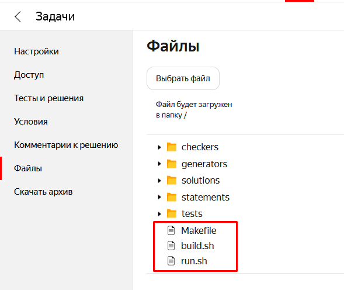
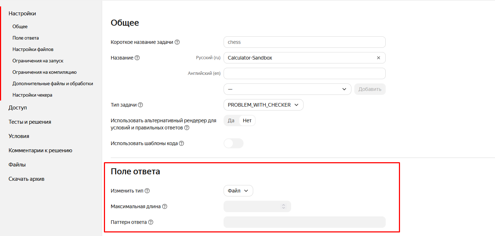
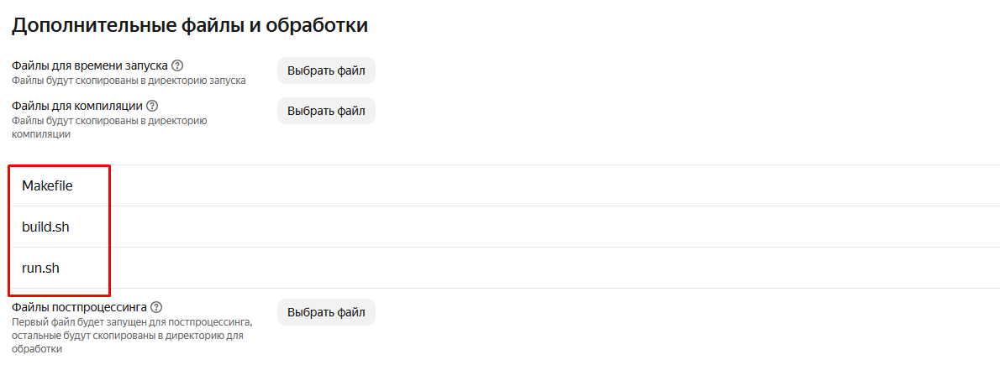
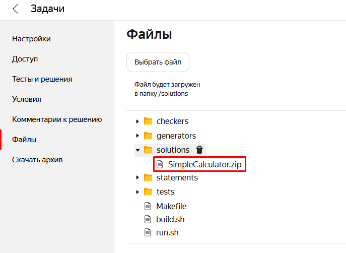
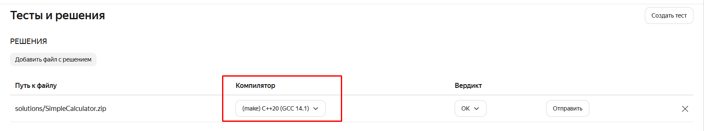

# Порядок работы над переносом заданий на платформу Яндекс.Контест

Бронировать можно не более 2-3 задач про запас.
Сперва завершите работу над текущими задачами, а потом беритесь за новые.

## Ознакомьтесь с документацией

Есть видеокурс по работе в системе. Просмотрите уроки, имеющие отношение к созданию задаче и их проверке.

<https://cs.hse.ru/olymp/yacontest>

## Поэкспериментируйте с задачей в песочнице

Вам будет выдан доступ к задаче с названием Sandbox-ВашаФамилия, в которой вы можете проводить эксперименты.

В некоторых задачах требуются иллюстрации. Изучите возможности платформы Яндекс.Контест по вставке изображений.

## Заведите Issue на гитхаб-аккаунте со списком доработок, которые нужно сделать по вашей задаче

Этот шаг нужен, чтобы вы не забыли, что нужно сделать.
Посмотрите примеры уже существующих Issues, чтобы было понятно, что туда обычно записывают.
Также в Issue по задаче я буду отписывать замечания по необходимым доработкам.

## Отредактируйте описание задачи

Некоторые задачи в нынешнем виде получают данные из внешнего файла, а не из stdin,
однако с небольшими доработками можно изменить условие так, чтобы 
программа принимала данные из stdin, а выводила в stdout.

В этом случае нужно отредактировать описание задачи на гитхабе.
В качестве примера рассмотрим [условие задачи FindText](example1.md).
Условие изменено так, чтобы программа могла принимать данные не только из файла, но и из stdin.

Так как программы будут тестироваться автоматически, условие задачи должно быть таким, чтобы студенту понятен формат входных и выходных данных.

Например, если программе подаются на вход целые числа, то нужно указать, каким образом эти числа разделяются (пробелами, табуляциям или же переносами строки).
На C++ при чтении из `std::cin` операцией `>>` пробелы, табуляции и символы переноса строки пропускаются.
На других языках программирования чтение таких данных может оказаться более трудоёмким.
В этом случае можно упростить жизнь студенту, сказав, что числа разделяются одним пробелами.

То же самое касается и выходных данных: лучше тоже уточнить формат выходных данных:

- как должны разделяться выводимые данные?
- с какой точностью должны выводиться числа с плавающей запятой.
- какой текст должен выводиться в случае ошибки (или ошибок)

В подавляющем большинстве заданий следует использовать английский язык, чтобы студенту не пришлось решать проблемы с юникодом.

Для редактирования markdown-файлов рекомендую использовать Visual Studio Code. Установите расширения:

- Markdown All in One
- markdownlint
- Code Spell Checker
- Russian - Code Spell Checker.

В некоторых задачах может потребоваться внести дополнительные ограничения на работу программы, чтобы ее проще было протестировать.
Например, в лабиринте может быть несколько (или даже очень много) кратчайших путей между двумя точками.
Чтобы не писать кастомный матчер, можно потребовать, чтобы при наличии нескольких вариантов сделать шаг вдоль кратчайшего маршрута, они выбирались в следующем порядке: вверх, вниз, влево, вправо.

## Отправьте Pull Request (PR) (на мерж в ветку master-new)

Свои изменения вносите в отдельную ветку, ответвлённую от master-new.

Оформите запрос на слияние ваших изменений c описанием задачи в ветку master-new.

- Один PR должен включать изменения по одной задаче.
- Если вы внесли изменения в несколько задач, оформите два разных PR (каждый в отдельной ветке), каждый из которых содержит изменения только по одной задаче.
  Так вы получите меньше изменений и ваши правки будут приняты быстрее.

Пока ваш PR проверяется, приступайте к следующему шагу - редактированию задачи в Яндекс.Contest

## Отредактируйте задачу на платформе Яндекс.Contest

Перенесите текст условия задачи на платформу (лучше всего в формате markdown). Составьте для задачи набор тестовых файлов, позволяющих качественно проверить работу программы.

Обязательно должны быть тестовые файлы, проверяющие работу программы на данных, указанных в условии задачи (в Яндекс.Контест можно часть тестов сделать открытыми).

Тестовые данных должны проверять работу программы на разных классах эквивалентности, на граничных данных. Тесты должны пропускать правильно написанную программу, а написанную с ошибками — отлавливать.

В некоторых программах (например, Car и TV) лучше больше небольших пар input-output, чем один или 2 больших файла.

При переносе условия задачи обратите внимание на форматирование. Возможно, его потребуется подправить. Например, изменить уровень вложенности заголовков (в github-репозитории они, скорее всего глубже, чем на Yandex.Contest).

## Проверьте работу эталонной программы

Напишите свою (или возьмите у одногруппников, решивших задачу) программу и проверьте, пройдёт ли она все проверки.

Внесите в программу изменения, заведомо делающие её некорректной или частично реализованной, и убедитесь, что тесты отлавливают эти ошибки.
Например, в программе TV можно закомментировать или сделать неверной проверку граничных условий и убедиться, что тесты обнаруживают этот недостаток.

Эталонное решение загрузите на странице "Тесты и решения".
Рекомендуется загрузить несколько решений, например, правильную программу и несколько заведомо неправильных.
Неправильные решения нужны, чтобы легко можно было убедиться, что тесты отлавливают ошибки.

## Если задание предполагает решение из нескольких файлов

Задания по ООП часто требуют написания программ, которые включают в себя несколько файлов,
описывающих различные классы (например, задание "Shapes").
В этом случае решение можно загрузить в виде архива, однако для корректной работы программы
необходимо выполнить специальные действия по настройке компилятора в системе Яндекс.Contest.

### Настройка работы с архивами

Для того чтобы настроить задачу для работы с архивами решений, необходимо выполнить следующее:

- В разделе **Файлы** загрузите скрипты для компилятора **make** (см. **makefile-scripts** в папке **yandex-contest**)

  

- В разделе **Настройки** в **Поле ответа** выберите тип **Файл**.
  Это нужно для того, чтобы студент мог загрузить только архив с файлами программы (иначе решение не будет скомпилировано)
  
  

- В этом же разделе перейдите в **Дополнительные файлы и обработки** (в самом низу)
 и добавьте в **Файлы для компиляции** загруженные ранее скрипты - сначала `Makefile`,
 затем `build.sh` и после него `run.sh` (**порядок загрузки важен**). Нажмите **Сохранить**

  

Теперь задача настроена на компиляцию решений, загруженных студентом в формате **zip**. 
В файле `build.sh` по умолчанию используется компилятор, использующий стандарт языка C++ версии **C++20**. 
При необходимости его можно изменить:

```bash
g++ -std=c++20 -o program *.cpp
```

Однако для **тестирования** эталонной программы, состоящей из нескольких файлов, также потребуются специальные действия

### Тестирование решения из нескольких файлов

Для тестирования программы, состоящей из нескольких файлов, необходимо выполнить следующие действия:

- Заархивируйте файлы программы в **zip** (**добавляйте в архив только файлы исходников, без файлов среды разработки и т.п**)
- Полученный zip заархивируйте в **rar** - иначе Яндекс.Contest автоматически распакует его при загрузке в систему.  
  Такой способ предложен в [справочнике Яндекс.Contest](https://admin.contest.yandex.ru/docs/ru/problem/files#load) (**студентам это делать не нужно**).  
  В качестве архиватора можно использовать WinRAR
- Загрузите полученный **rar** архив в **Файлы** в настройках задачи. После загрузки архив не должен быть распакован
  
  

- Добавьте загруженный архив в **Решения** в разделе **Тесты и решения**.
Выберите компилятор с приставкой **make**, соответствующий стандарту языка C++, указанному в скрипте `build.sh`.
Для C++20 - это **(make) C++20 (GCC 14.1)**

  

Теперь система настроена для запуска тестов. После отправки посылки с решением тесты будут вести себя так же,
как и в случае с обычной программой, загруженной в виде одного файла.

### Изменение условия задания

Не забудьте добавить соответствующее примечание в условие задания с инструкцией по загрузке решения в систему **Яндекс.Contest**.
Примечание может выглядеть следующим образом:

```txt
#### Тестирование программы в системе Яндекс.Contest

Для корректного тестирования программы в системе Яндекс.Contest необходимо заархивировать файлы программы в **формат zip** и загрузить архив в систему Яндекс.Contest,
**даже если решение состоит всего из одного файла**.
```
